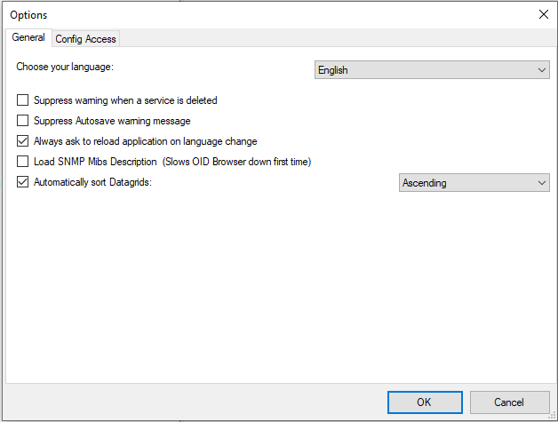

Multi-Language Client
=====================

The Client comes with multiple languages ready to go. Out of the
box English, German and Japanese are supported. Languages can be switched
instantly. Language settings are specific to a user.

Additional languages can be easily integrated using Adiscon's XML based
localization technology. We ask customers interested in an additional language
for a little help with the translation work (roughly 1 hour of work). Adiscon
will then happily create a new version. This service is free!

