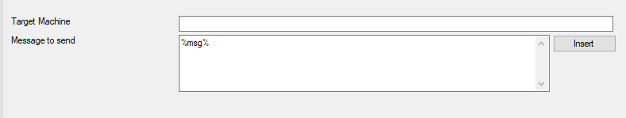

:orphan:

Net Send
========

Send short alert messages to a recipient machine via the Windows
Messenger service (``net send``).

.. warning::

   **Deprecated:** ``net send`` pop-up messages are not available by default on
   modern Windows versions and are unreliable in many environments. Prefer
   modern alerting methods like sending email or forwarding to syslog.

* Net Send*

Here is an example how to receive :doc:`notifications via net send <../shared/gettingstarted/alarmingvianetsend>`.

Further details can be found here: :doc:`net send <../mwagentspecific/a-netsend>`.
