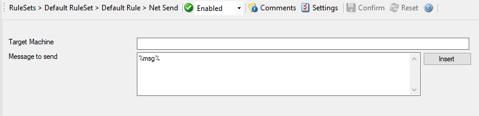

Net Send
========

This helps to send short alert messages to recipient machine via Windows Net
Send facility. Great for alerting logged-on administrators.

* Net Send*

Here is an example how to receive :doc:`notifications via net send <../shared/gettingstarted/alarmingvianetsend>`.

Further details can be found here: :doc:`net send <../mwagentspecific/a-netsend>`.
