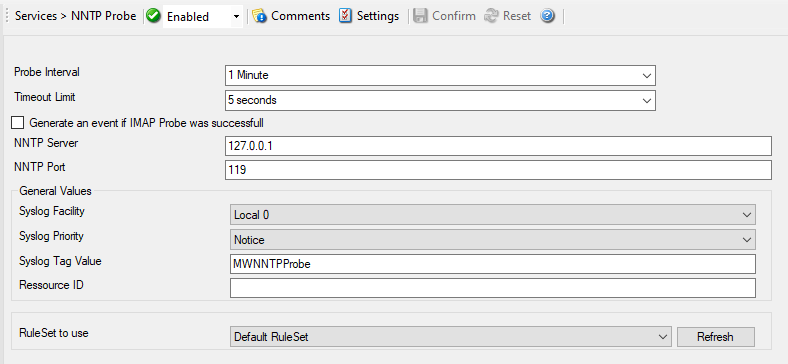

NNTP Probe
==========

NNTP Probe checks if a NNTP server is actually alive. NNTP probe does a
connection to NNTP server. After receiving the response from NNTP server it
sends the QUIT command to terminate the connection.

* NNTP Probe*

Here is an example how to monitor :doc:`nntp server via nntp probe <../shared/gettingstarted/monitoringnntpserver>`.

Further details can be found here: :doc:`nntp probe <../mwagentspecific/nntpprobe>`.
