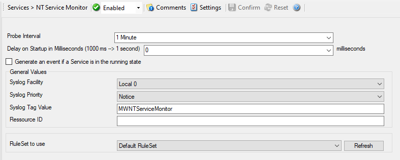

NT Service Monitor
==================

This feature is used to monitor if vital operating services are running. The
monitor continuously checks all services set to "automatic" startup. If such a
service does not run, an event is generated and passed to the rule engine
(which, for example, can restart the service).

* NT Service Monitor*

Further details can be found here: :doc:`nt service monitor <../mwagentspecific/ntservicemonitor>`.
