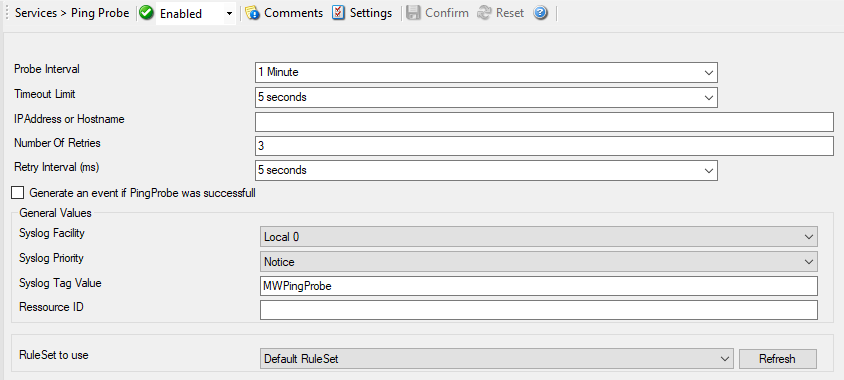

Ping Probe
==========

Ping Probe is typically used to check the availability of a remote system. The
Ping Probe periodically sends ping messages. As long as responses are received,
nothing happens. If no response is received, it generates an event and passes
it to the :doc:`rule engine <../glossaryofterms/ruleengine>`. As ping messages can get lost, the ping probe will retry
failed probes before it reports an error. Both the number of retries and the
retry interval can be specified.

* Ping Probe*

Here is an example how to monitor :doc:`external devices via ping <../shared/gettingstarted/monitoringexternaldevicesping>`.

Further details can be found here: :doc:`ping probe <../mwagentspecific/pingprobe>`.
