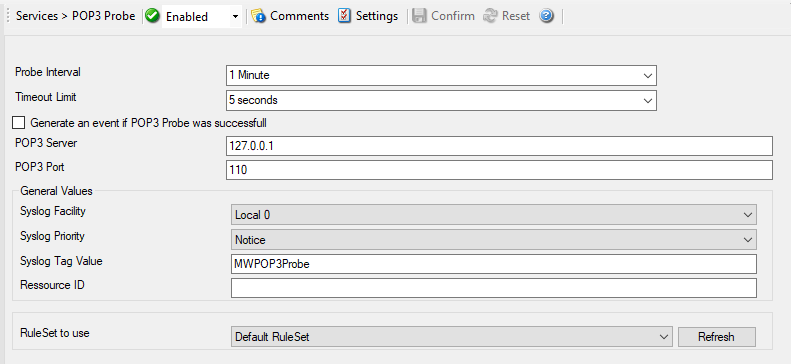

POP3 Probe
==========

POP3 probe checks if a POP3 server is actually alive. POP3 probe does a
connection to POP3 server. It receives the response and sends the QUIT command
to terminate the connection.

* POP3 Probe*

Further details can be found here: :doc:`pop3 probe <../mwagentspecific/pop3probe>`.
