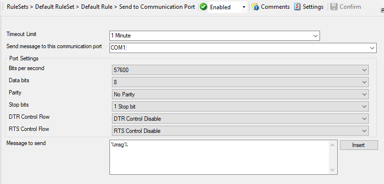

Send to Communication Port
==========================

It allows to send a string to an attached communications device, that is it
sends a message through a Serial Port.

* Send to Communications Port*

Further details can be found here:
:doc:`send to communications port <../mwagentspecific/a-sendtocommunicationsport>`.
