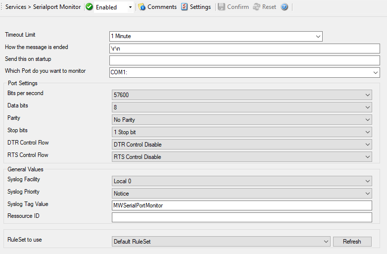

Serial Port Monitor
===================

The Serial Port Monitor Service allows to monitor devices attached to local
communications ports. This is not limited to serial (RS232) devices – devices
e.g. connected via the LPT or other ports can also be monitored as long as the
device provides a proper interface. The device monitor can often be used to
monitor devices that are normally not network-accessible at all
(like some PBXs).

The Serial Port Monitor listens to the configured port. With each received
character, it checks if a configured "message send sequence" is received. If it
is not, it continues listening until either another character is received or a
timeout occurs. If either the "message end sequence" is received or the
timeout occurred, the message is considered to be complete. In this case, an
event is generated and get scheduled for processing.

* Serial Port Monitor*

Further details can be found here:
:doc:`serial port monitor <../mwagentspecific/serialportmonitor>`.
