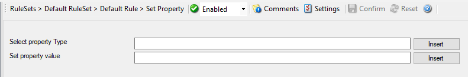

Set Property
============

With the "Set Property", some properties of the incoming message can be
modified. This is especially useful if an administrator would like to e.g.
rename two equally named servers.

Further details can be found here:
:doc:`set property <../mwagentspecific/a-setproperty>`.
