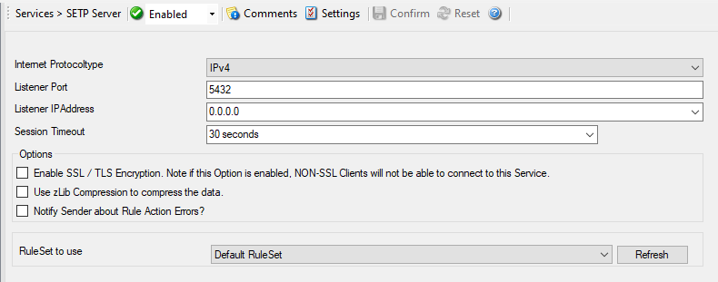

SETP Server
===========

MonitorWare Agent configures a SETP Server Service. A SETP Server is used
inside the MonitorWare line of products to ensure reliable delivery of events
from other systems. There are only few configuration options, as SETP takes the
original message from the sender and uses the exact settings that the sender
was configured for. No alteration occurs at the SETP server side; as such, no
values need to be configured for the message format. SETP traffic can optionally
be SSL-protected.

* SETP Server*

Further details can be found here:
:doc:`setp server <../mwagentspecific/setpserver>`.
