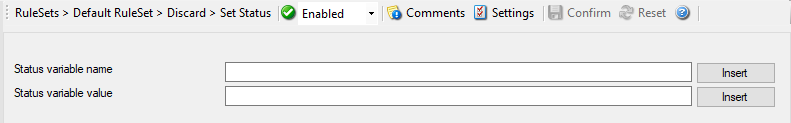

Set Status
==========

Each :doc:`information unit <../glossaryofterms/mwconcepts-informationunit>` has certain properties e.g. EventID, Priority, Facility
etc. You can create a new property and assign any valid desired value as well
as filter to it. This is great for very demanding situations where complex rule
sets are needed.

* Set Status*

Further details can be found here:
:doc:`set status <../mwagentspecific/a-setstatus>`.
