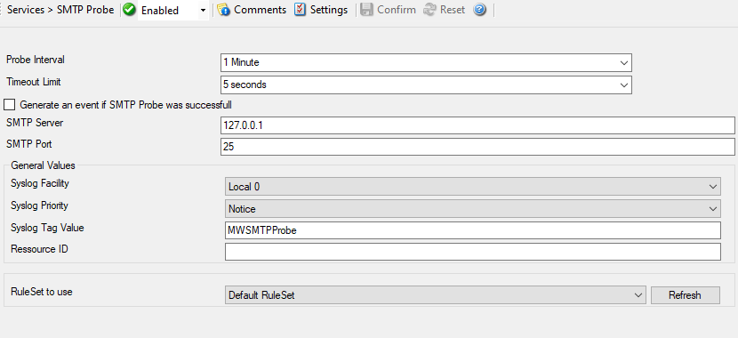

SMTP Probe
==========

SMTP Probe checks if a SMTP server is actually alive. SMTP probe does a
connection to SMTP server. It receives the response and sends the QUIT command
to terminate the connection.

* SMTP Probe*

Here is an example how to monitor :doc:`smtp server via smtp probe <../shared/gettingstarted/monitoringsmtpserver>`.

Further details can be found here:
:doc:`smtp probe <../mwagentspecific/smtpprobe>`.
