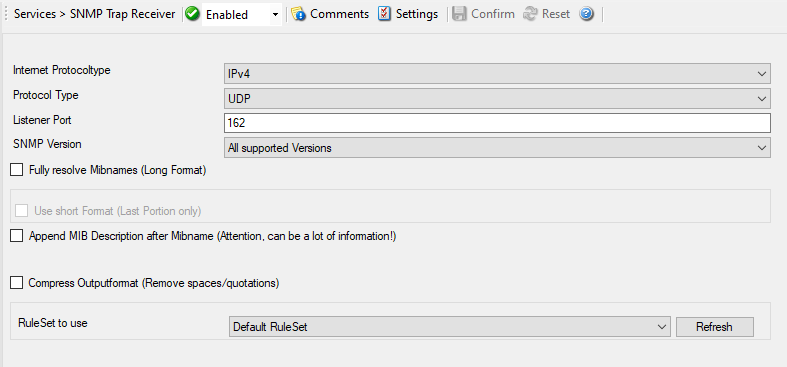

SNMP Trap Receiver
==================

SNMP Trap Receiver service allows to receive SNMP messages. A rough description
of a Trap is that it is somewhat like a Syslog message, just over another
protocol (SNMP). A trap is generated when the device feels it should do so and
it contains the information that the device feels should be transmitted. It
also contains some (few) standard items, as the version, community etc.
MonitorWare Agent supports decoding of MID values and also supports forwarding
SNMP traps via other protocols, for example syslog.

* SNMP Trap Receiver*

Further details can be found here:
:doc:`snmp trap receiver <../mwagentspecific/snmptrapreceiver>`.
