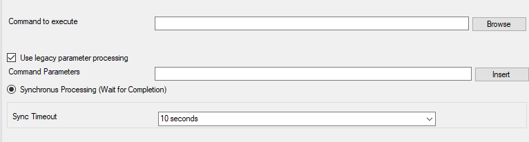

Start Program
=============

With this, an external program can be run. Any valid Windows executable can be
run. This includes actual programs (EXE files) as well as scripts like batch
files (.BAT) or VB scripts (.vbs). Start Program can, for example, be combined
with the service monitor to restart failed services.

* Start Program*

Further details can be found here:
:doc:`start program <../mwagentspecific/a-startprogram>`.
