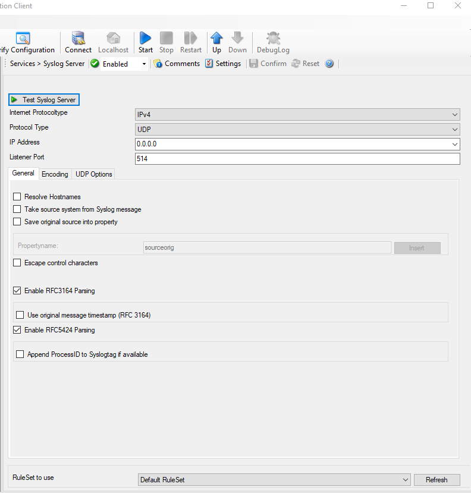

Syslog server
=============

This is a full-featured Syslog server, including support for syslog via TCP and
RFC 3195. MonitorWare Agent helps to Configure a Syslog server service.
It can be set to listen to any valid port. UDP and TCP communication is
supported.

* Syslog server*

Further details can be found here:
:doc:`syslog server <../mwagentspecific/syslogserver>`.
