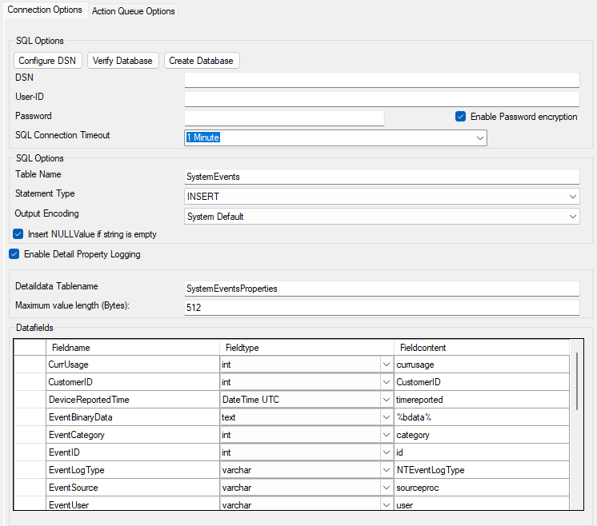

Write to Database
=================

Database logging allows persisting all incoming messages to a database. Once
they are stored inside the database, different message viewers as well as
custom applications can easily browse them.

* Write to Database*

Further details can be found here:
:doc:`write to database <../shared/references/a-databaseoptions>`.
