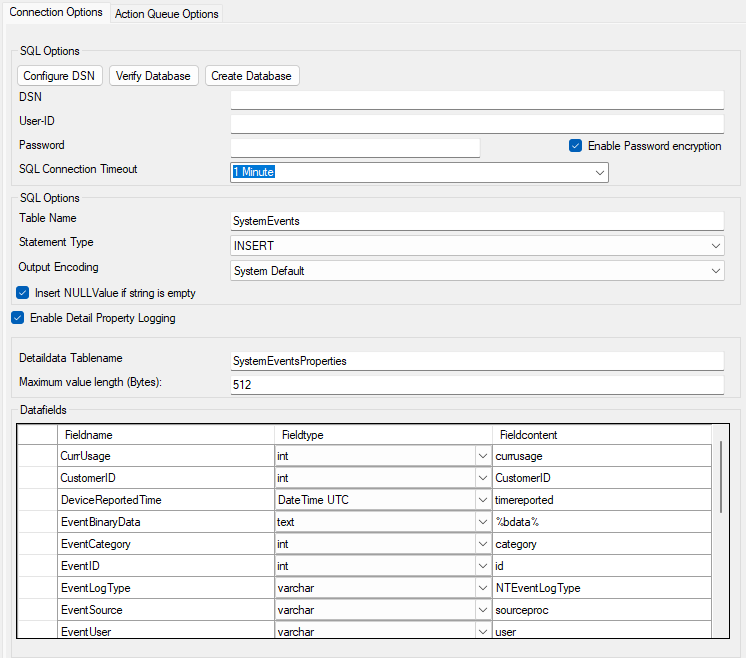

:orphan:

Write to Database
=================

Database logging allows persisting all incoming messages to a database. Once
they are stored inside the database, different message viewers as well as
custom applications can easily browse them.

This feature is not limited to the built-in Adiscon schema. Depending on the
action configuration, it can write to the default schema or to an existing
user-defined schema in a supported database.

Use the default schema when you want the fastest supported setup or
compatibility with Adiscon tools. Use custom mapping when your environment
already has a destination table that the product must write into.

* Write to Database*

Further details can be found here:
:doc:`write to database <../mwagentspecific/a-databaseoptions>`.
