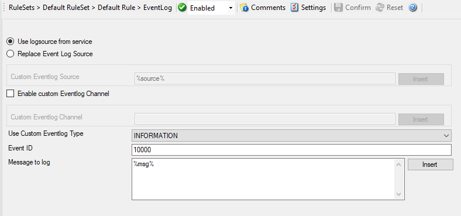

Write to Event Log
==================

Allows any event (e.g. syslog, SNMP trap, protocol probes) to be written to the
Windows Event Log. It is used to configure the logging to the Windows
or XP event log. It is primarily included for legacy purposes.

* Write to Event Log*

Further details can be found here:
:doc:`event log <../mwagentspecific/a-eventlogoptions>`.
