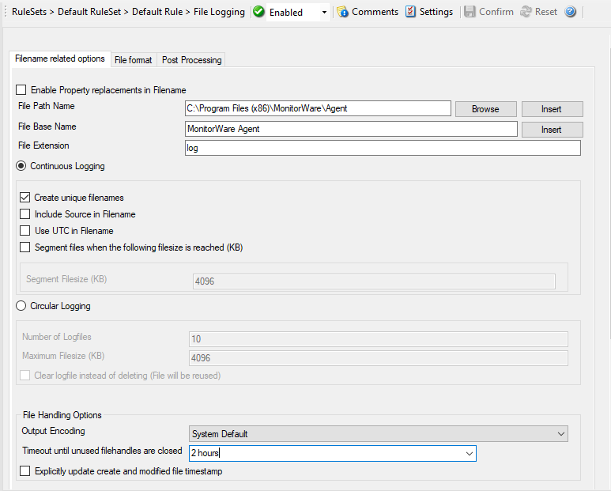

Write to File
=============

All incoming events – no matter what source they came from – can be stored
persistently. Options include archiving in databases as well as log files.
File logging is used to write text files of received messages. One file per
day is written. New entries are appended to the end of the file.

* Write to File*

Further details can be found here:
:doc:`write to file <../mwagentspecific/a-fileoptions>`.
