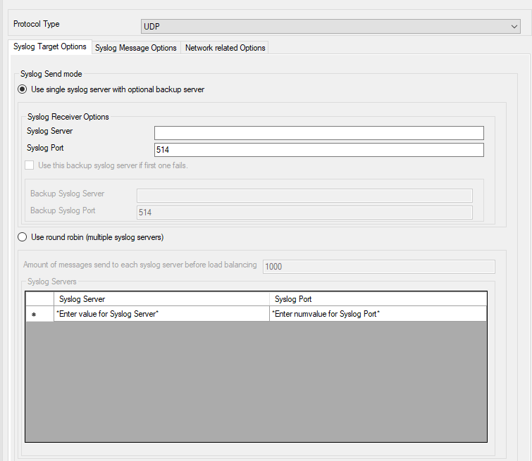
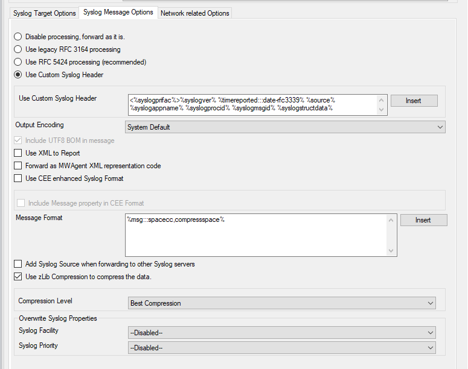
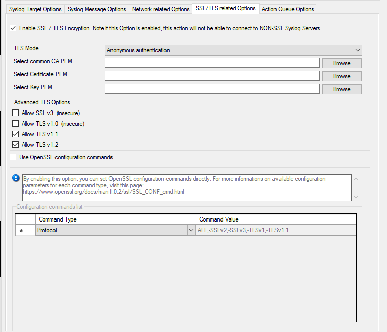
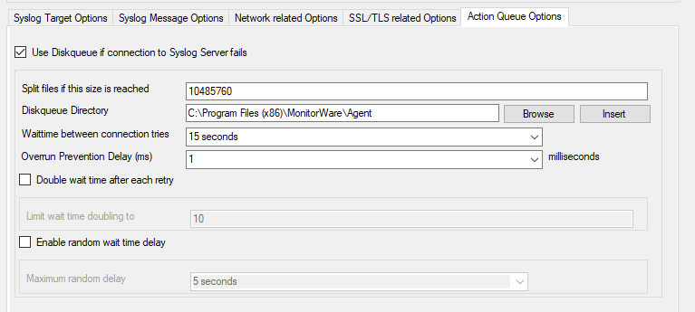

Syslog Forwarding
=================

Protocol Type
-------------

There are various ways to transmit syslog messages. In general,they can be sent
via UDP, TCP, or RFC 3195 RAW. Typically, syslog messages are received via UDP
protocol, which is the default. UDP is understood by almost all servers, but
does not guarantee transport. In plain words, this means that syslog messages
sent via UDP can get lost if there is a network error, the network is congested
or a device (like a router or switch) is out of buffer space. Typically, UDP
works quite well. However, it should not be used if the loss of a limited
number of messages is not acceptable.

TCP and RFC 3195 based syslog messages offer much greater reliability. RFC 3195
is a special standardized transfer mode. However, it has not receive any
importance in practice. Servers are hard to find. As one of the very few,
Adiscon products support RFC 3195 also in the server implementations. Due to
limited deployment, however, RFC 3195 is very little proven in practice.
Thus we advise against using RFC 3195 mode if not strictly necessary (e.g. part
of your requirement sheet).

TCP mode comes in three flavors. This stems back to the fact that transmission
of syslog messages via plain TCP is not yet officially standardized (and it is
doubtful if it ever will be). However, it is the most relevant and most widely
implemented reliable transmission mode for syslog. It is a kind of unwritten
industry standard. We support three different transmission modes offering the
greatest compatibility with all existing implementations. The mode "TCP (one
message per connection)" is a compatibility mode for Adiscon servers that are
older than roughly June 2006. It may also be required for some other vendors.
We recommend not to use this setting, except when needed. "TCP (persistent
connection)" sends multiple messages over a single connection, which is held
open for an extended period of time. This mode is compatible with almost all
implementations and offers good performance. Some issues may occur if control
characters are present in the syslog message, which typically should not
happen. The mode "TCP (octet-count based framing)" implements algorithms of an
IETF standard RFC 6587. It also uses a persistent
connection. This mode is reliable and also deals with embedded control
characters very well. This standard is now widely supported by modern syslog
receivers and implementations.

As a rule of thumb, we recommend to use "TCP (octet-count based framing)" if
you are dealing only with (newer) Adiscon products. Otherwise,
"TCP (persistent connection)" is probably the best choice. If you select one
of these options, you can also select a timeout. The connection is torn down if
that timeout expires without a message being sent. We recommend to use the
default of 30 minutes, which should be more than efficient. If an installation
only occasionally sends messages, it could be useful to use a lower timeout
value. This will free up connection slots on the server machine.

Syslog Target Options
---------------------

* Action - Forward Syslog Target Options*

Syslog Send mode
^^^^^^^^^^^^^^^^

**File Configuration field:**
  nSendMode

**Description**
  The Sendmode has been added since 2018 into all products supporting the
  forward syslog action. There are two options available.

  **Use single Syslog server with optional backup server**
  This is the classic syslog send mode which uses a primary Syslog server and
  a secondary backup Syslog server if configured.

  **Use round robin (multiple syslog servers)**
  This new method allows you to configure multiple targets that will be used
  one by one after a configured amount of messages has been sent to each target.

Syslog server (Syslog Send mode)
^^^^^^^^^^^^^^^^^^^^^^^^^^^^^^^^

**File Configuration field:**
  szSyslogSendServer

**Description:**
  This is the name or IP address of the system to which Syslog messages should
  be sent to. You can either use an IPv4, an IPv6 Address, or a Hostname that
  resolves to an IPv4 or IPv6 Address.

Syslog Port (Syslog Send mode)
^^^^^^^^^^^^^^^^^^^^^^^^^^^^^^

**File Configuration field:**
  nSyslogSendPort

**Description:**
  The remote port on the Syslog server to report to. If in doubt, please leave
  it at the default value of 514, which is typically the Syslog port. Different
  values are only required for special setups, for example in security
  sensitive areas. Set the port to 0 to use the system-supplied default value
  (which defaults to 514 on almost all systems).

  Instead of the port number, a service name can be used. If so, that name is
  looked up via the socket service database functions.

Use this backup Syslog server if first one fails
^^^^^^^^^^^^^^^^^^^^^^^^^^^^^^^^^^^^^^^^^^^^^^^^

**File Configuration field:**
  nEnableBackupServer

**Description:**
  The backup server is automatically used if the connection to the primary
  server fails. The primary server is automatically retried when the next
  Syslog session is opened. This option is only available when using TCP syslog.

Use round robin (multiple Syslog server)
^^^^^^^^^^^^^^^^^^^^^^^^^^^^^^^^^^^^^^^^

Amount of messages send to each Syslog server before load balancing
^^^^^^^^^^^^^^^^^^^^^^^^^^^^^^^^^^^^^^^^^^^^^^^^^^^^^^^^^^^^^^^^^^^

**File Configuration field:**
  nRoundRobinMsgCount

**Description:**
  When using round robin mode, this is the amount of messages to be sent to
  each configured Syslog server.

Syslog server (Round robin mode)
^^^^^^^^^^^^^^^^^^^^^^^^^^^^^^^^

**File Configuration field:**
  szSyslogServer_[n]

**Description:**
  This is the name or IP address of the system to which Syslog messages should
  be sent to. You can either use an IPv4, an IPv6 Address, or a Hostname that
  resolves to an IPv4 or IPv6 Address.

Syslog Port (Round robin mode)
^^^^^^^^^^^^^^^^^^^^^^^^^^^^^^

**File Configuration field:**
  nSyslogPort_[n]

**Description:**
  The remote port on the Syslog server to report to. If in doubt, please leave
  it at the default value of 514, which is typically the Syslog port. Different
  values are only required for special setups, for example in security
  sensitive areas. Set the port to 0 to use the system-supplied default value
  (which defaults to 514 on almost all systems).

  Instead of the port number, a service name can be used. If so, that name is
  looked up via the socket service database functions.

Syslog Message Options
----------------------

* Action - Forward Syslog - Message Options*

Syslog processing
^^^^^^^^^^^^^^^^^

**File Configuration field:**
  bProcessDuringRelay

  * 0 = Disable processing, forward as it is
  * 1 = RFC3164 Header - Use legacy RFC 3164 processing
  * 2 = RFC5424 Header - Use RFC 5424 processing (recommended)
  * 3 = Custom Syslog Header

**Description:**
  With this settings you can assign how your syslog messages will be processed.

  For processing syslog you can choose out of four different options. You can
  use :doc:`rfc3164 <../glossaryofterms/rfc3164>` or RFC5424 (recommended) which is the current syslog standard,
  you are able to customize the syslog header or you do not process your syslog
  and forwards it as it is.

Use Custom Syslog Header
^^^^^^^^^^^^^^^^^^^^^^^^

**File Configuration field:**
  szCustomSyslogHeader

**Description:**
  In this field you can specify the contents of your syslog header. This option
  is only available when you choose "Use Custom Syslog Header" in the Syslog
  Processing menu. The contents can be either a fixed message part which you
  can write into the field yourself or you use properties as dynamic content.
  By default the Header field is filled with the content of the RFC 5424 header.

  **Please note** that the header content of the Header field can be configured. :doc:`event properties <shared/references/eventspecificproperties>` are described in the
  :doc:`property replacer section <shared/references/eventproperties>`.

Output Encoding
^^^^^^^^^^^^^^^

**File Configuration field:**
  nOutputEncoding

**Description:**
  This setting is most important for Asian languages. A good rule is to leave
  it at "System Default" unless you definitely know you need a separate
  encoding. "System Default" works perfect in the far majority of cases, even
  on Asian (e.g. Japanese) Windows versions.

Include UTF8 BOM in message
^^^^^^^^^^^^^^^^^^^^^^^^^^^

**File Configuration field:**
  nProtocolType

**Description:**
  If enabled (default), the UTF8 BOM code will be prepended to the output
  message if you are using UTF8 Output encoding. If the syslog receiver cannot
  handle and remove the UTF8 BOM you can disabled this option.

Use XML to Report
^^^^^^^^^^^^^^^^^

**File Configuration field:**
  bReportInXML

**Description:**
  If this option is checked, the forwarded Syslog message is a complete
  XML-formatted information record. It includes additional information like
  timestamps or originating system in an easy to parse format.

  The XML formatted message is especially useful if the receiving system is
  capable of parsing XML data. However, it might also be useful to a human
  reader as it includes additional information that cannot be transferred
  otherwise.

Forward as MonitorWare Agent XML Representation Code
^^^^^^^^^^^^^^^^^^^^^^^^^^^^^^^^^^^^^^^^^^^^^^^^^^^^

**File Configuration field:**
  nForwardIUT

**Description:**
  MonitorWare supports a specific XML-Representation of the event. If it is
  checked, that XML representation is used. It provides additional information
  (like informationunit type, original source system, reception time & many
  more) but is harder to read by a human. At the same time, it is obviously
  easier to parse.

Use CEE enhanced Syslog Format
^^^^^^^^^^^^^^^^^^^^^^^^^^^^^^

**File Configuration field:**
  nReportInJSON

**Description:**
  If enabled, the CEE enhanced Syslog format will be used. All useful properties
  will be included in a JSON Stream. The message itself can be included as well,
  see the "Include message property in CEE Format" option. Here is a sample how
  the format looks like for a security Eventlog message:

  ``@cee: {"source": "machine.local", "nteventlogtype": "Security", "sourceproc": "Microsoft-Windows-Security-Auditing", "id": "4648", "categoryid": "12544", "category": "12544", "keywordid": "0x8020000000000000", "user": "N\\\\A", "SubjectUserSid": "S-1-5-11-222222222-333333333-4444444444-5555", "SubjectUserName": "User", "SubjectDomainName": "DOMAIN", "SubjectLogonId": "0x5efdd", "LogonGuid": "{00000000-0000-0000-0000-000000000000}", "TargetUserName": "Administrator", "TargetDomainName": " DOMAIN ", "TargetLogonGuid": "{00000000-0000-0000-0000-000000000000}", "TargetServerName": "servername", "TargetInfo": " servername ", "ProcessId": "0x76c", "ProcessName": "C:\\\\Windows\\\\System32\\\\spoolsv.exe", "IpAddress": "-", "IpPort": "-", "catname": "Logon", "keyword": "Audit Success", "level": "Information", }``

  Additionally to this format you can set: Include message property in CEE
  Format.

  If enabled, the message itself will be included in the JSON Stream as
  property. Disable this option if you do not want the message itself in the
  CEE Format.

  **Please note you can also make Event ID part of the actual Syslog message while forwarding to a Syslog server then you have to make some changes in
  the Forward Syslog Action.**
  `Click here <https://www.mwagent.com/faq/general-questions/how-can-i-make-event-id-part-of-the-actual-syslog-message-while-forwarding-to-a-syslog-server/>`_ to know the settings.

Include message property in CEE Format
^^^^^^^^^^^^^^^^^^^^^^^^^^^^^^^^^^^^^^

**Description**
  If enabled, the message itself will be included in the JSON Stream as
  property. Disable this option if you do not want the message itself in the
  CEE Format.

  **Please note** you can also make Event ID part of the actual Syslog message while forwarding to a Syslog server then you have to make some changes in
  the Forward Syslog Action.
  :doc:`click here <../articles/include-event-id-in-syslog-msg>` to know the settings.

Message Format
^^^^^^^^^^^^^^

**File Configuration field:**
  szMessageFormat

**Description:**
  The custom format lets you decide how the content of a syslog message looks
  like. You can use properties to insert content dynamically or have fixed
  messages that appear in every message. Event properties are described in the
  property replacer section.

Add Syslog Source when forwarding to other Syslog servers
^^^^^^^^^^^^^^^^^^^^^^^^^^^^^^^^^^^^^^^^^^^^^^^^^^^^^^^^^

**File Configuration field:**
   nSyslogInsertSource

**Description:**
  If this box is checked, information on the original originating system is
  prepended to the actual message text. This allows the recipient to track
  where the message originally came from.

  **Please note:** This option is not compatible with RFC 3164. We recommend selecting it primarily when message forwarding to a WinSyslog Interactive
  Server is intended.

Use zLib Compression to compress the data
^^^^^^^^^^^^^^^^^^^^^^^^^^^^^^^^^^^^^^^^^

**File Configuration field:**
  nUseCompression

**Description:**
  With this option you can set the grade of compression for your syslog
  messages. For more information please read the note at the bottom of this
  page.

Compression Level
^^^^^^^^^^^^^^^^^

**File Configuration field:**
  nCompressionLevel

  * 1 = Best Speed
  * 3 = Low Compression
  * 6 = Normal Compression
  * 9 = Best Compression (default)

**Description:**
  With this option you can set the grade of compression for your syslog
  messages. For more information please read the note at the bottom of this
  page.

  **Note on Using Syslog Compression**

  Compressing syslog messages is a stable but rarely used feature. There is only a very
  limited set of receivers who are able to understand that format. Turning on
  compression can save valuable bandwidth in low-bandwidth environments.
  Depending on the message, the saving can be anything from no saving at all to
  about a reduction in half. The best savings ratios have been seen with
  Windows Event Log records in XML format. In this case, 50% or even a bit more
  can be saved. Very small messages do not compress at all. Typical syslog
  traffic in non-xml format is expected to compress around 10 to 25%.

  Please note that compression over TCP connections requires a special
  transfer mode. This mode uses OpenSSL TLS Implementation 3.x for secure
  transmission. TLS compression is not implemented; instead, the system uses
  standard OpenSSL compression mechanisms.

  Besides the fact that the mechanisms behind compression are experimental, the
  feature itself is solid.

Overwrite Syslog Properties
---------------------------

Syslog Facility
^^^^^^^^^^^^^^^

**File Configuration field:**
  nSyslogFacility

**Description:**
  When configured, will overwrite the Syslog Facility with the configured
  value.

Syslog Priority
^^^^^^^^^^^^^^^

**File Configuration field:**
 nSyslogPriority

**Description:**
  When configured, will overwrite the Syslog Priority with the configured
  value.

SSL/TLS related Options
-----------------------

* Action - Forward Syslog SSL/TLS related Options*

Enable SSL / TLS Encryption
^^^^^^^^^^^^^^^^^^^^^^^^^^^

**File Configuration field:**
  nUseSSL

**Description:**
  If this option is enabled, the action will not be able to talk to a NON-SSL
  secured server. The method used for encryption is compatible to RFC5425
  (Transport Layer Security (TLS) Transport Mapping for Syslog).

TLS Mode
^^^^^^^^

**File Configuration field:**
  nTLSMode

**Description:**
  **Anonymous Authentication**

  Default option. This means that a default certificate will be used.

  **Use Certificate**

  If this option is enable, you can specify your own certificate. For further
  authentication solutions, you will need to create your own certificates using
  OpenSSL Tools for example.

Select common CA PEM
^^^^^^^^^^^^^^^^^^^^

**File Configuration field:**
  szTLSCAFile

**Description:**
  Select the certificate from the common Certificate Authority (CA). The syslog
  receiver should use the same CA.

Select Certificate PEM
^^^^^^^^^^^^^^^^^^^^^^

**File Configuration field:**
  szTLSCertFile

**Description:**
  Select the client certificate (PEM Format).

Select Key PEM
^^^^^^^^^^^^^^

**File Configuration field:**
  szTLSKeyFile

**Description:**
  Select the keyfile for the client certificate (PEM Format).

Allow SSL v3
^^^^^^^^^^^^

**File Configuration field:**
  nTLSAllowSSLv3

**Description:**
  This option enables insecure protocol method SSLv3. We recommend NOT enabling
  this option as SSLv3 is considered broken.

Allow SSL v1.0
^^^^^^^^^^^^^^

**File Configuration field:**
  nTLSAllowTLS10

**Description:**
  This option enables insecure protocol method TLSv1. We recommend NOT enabling
  this option as TLSv1 is considered broken.

Allow SSL v1.1
^^^^^^^^^^^^^^

**File Configuration field:**
  nTLSAllowTLS11

**Description:**
  This option enables protocol method TLS1.1 which is enabled by default.

Allow SSL v1.2
^^^^^^^^^^^^^^

**File Configuration field:**
  nTLSAllowTLS12

**Description:**
  This option enables protocol method TLS1.2 which is enabled by default.

Allow TLS v1.3
^^^^^^^^^^^^^^

**File Configuration field:**
  nTLSAllowTLS13

**Description:**
  This option enables protocol method TLS1.3 which provides enhanced security and performance.

Use OpenSSL configuration commands
^^^^^^^^^^^^^^^^^^^^^^^^^^^^^^^^^^

**File Configuration field:**
  nTLSUseConfigurationCommands

**Description:**
  By enabling this option, you can set OpenSSL configuration commands directly.
  For more information's on available configuration parameters for each command
  type, visit this page:

  https://www.openssl.org/docs/man1.0.2/ssl/SSL_CONF_cmd.html

  We allow to the set the following OpenSSL configuration commands in the
  configuration commands list:

  * CipherString: Sets the allowed/disallowed used Ciphers. Setting this value
    will OVERWRITE the internal default ciphers.
  * SignatureAlgorithms: This sets the supported signature algorithms for
    TLS v1.2.
  * Curves: This sets the supported elliptic curves.
  * Protocol: Sets the supported versions of the SSL or TLS protocol. This will
    OVERWRITE the Allow SSL options from above!
  * Options: The value argument is a comma separated list of various flags to
    set.

  When setting advanced configuration commands, we highly recommend to enable
  debug logging and review it after changes have been made. An error will be
  logged in the debug logfile if a configuration command cannot be processed
  successfully.

TCP related Options
-------------------

When using TCP-based syslog forwarding, you have the additional option to use
the diskqueue. Whenever a connection to a remote Syslog server fails, the
action starts caching the syslog messages into temporary files. The folder for
these files can be configured. The filenames are generated using a unique GUID
which is automatically generated for each Action, thus enabling you to use this
feature in multiple Actions. Once the Syslog server becomes available again,
the cached messages are being sent automatically. If you restart the Service
while the Syslog Cache was active, it cannot be checked during service startup
if the Syslog server is available now. Once the action is called again, the
check is done and if the Syslog server is available, the messages are being
sent. The size of this cache is only limited by the disk size. Files are
split by 10MB by default, but this can also be configured. The maximum
supported file size is 2GB.

**Please Note:** This option is not available for UDP or RFC 3195.

Session Timeout
^^^^^^^^^^^^^^^

**File Configuration field:**
nTimeoutValue

Action Queue Options
--------------------

* Action - Forward Syslog Action Queue*

Use Diskqueue if connection to Syslog server fails
^^^^^^^^^^^^^^^^^^^^^^^^^^^^^^^^^^^^^^^^^^^^^^^^^^

**File Configuration field:**
  nUseDiscQueue

**Description:**
  Enable diskqueuing syslog messages after unexpected connection loss.

Split files if this size is reached
^^^^^^^^^^^^^^^^^^^^^^^^^^^^^^^^^^^

**File Configuration field:**
  nDiskQueueMaxFileSize

**Description:**
  Files will be split until they reach the configured size in bytes. The
  maximum support file size is 10485760 bytes.

Diskqueue Directory
^^^^^^^^^^^^^^^^^^^

**File Configuration field:**
  szDiskQueueDirectory

**Description:**
  The directory where the queue files will be generated in. The queuefiles will
  be generated with a dynamic UUID bound to the action configuration.

Waittime between connection tries
^^^^^^^^^^^^^^^^^^^^^^^^^^^^^^^^^

**File Configuration fields:**
  nDiskCacheWait

**Description:**
  The minimum waittime until the Syslog Action retries to establish a
  connection to the Syslog server after failure.

Overrun Prevention Delay (ms)
^^^^^^^^^^^^^^^^^^^^^^^^^^^^^

**File Configuration field:**
  nPreventOverrunDelay

**Description:**
  When the Action is processing syslog cache files, an overrun prevention delay
  can be added to avoid flooding the target Syslog server.

Double wait time after each retry
^^^^^^^^^^^^^^^^^^^^^^^^^^^^^^^^^

**File Configuration field:**
  bCacheWaittimeDoubling

**Description:**
  If enabled, the configured waittime is doubled after each try.

Limit wait time doubling to
^^^^^^^^^^^^^^^^^^^^^^^^^^^

**File Configuration field:**
  nCacheWaittimeDoublingTimes

**Description:**
  How often the waittime is doubled after a failed connection try.

Enable random wait time delay
^^^^^^^^^^^^^^^^^^^^^^^^^^^^^

**File Configuration field:**
  bCacheRandomDelay

**Description:**
  If enabled, a some random time will be added into the waittime delay. When
  using many syslog senders, this can avoid that all senders start sending
  cached syslog data to the Syslog server at the same time.

Maximum random delay
^^^^^^^^^^^^^^^^^^^^

**File Configuration field:**
  nCacheRandomDelayTime

**Description:**
  Maximum random delay time that will be added to the configured waittime if
  Enable random wait time delay is enabled.

UDP related Options
-------------------

Enable IP Spoofing for the UDP Protocol
^^^^^^^^^^^^^^^^^^^^^^^^^^^^^^^^^^^^^^^

**File Configuration field:**
  nSpoofIPAddress

**Description:**
  This option enables you to spoof the IP Address when sending Syslog messages
  over UDP. Some notes regarding the support of IP Spoofing. It is only
  supported the UDP Protocol and IPv4. IPv6 is not possible yet. Due system
  limitations introduced by Microsoft, IP Spoofing is only possible on Windows
  Server 2003, 2008, or higher. It is NOT possible in Windows XP, VISTA, 7, or
  higher. For more information see the Microsoft explanation. Also please note
  that most routers and gateways may drop network packages with spoofed IP
  Addresses, so it may only work in local networks.

Fixed IP or single property
^^^^^^^^^^^^^^^^^^^^^^^^^^

**File Configuration field:**
  szSpoofedIPAddress

**Description:**
  You can either use a static IP Address or a property. When using a property,
  the IP Address is tried to be resolved from the content of the property. For
  example by default the ``%source%`` property is used. If the name in this
  property cannot be resolved to an IP Address, the default local IP Address
  will be used.
