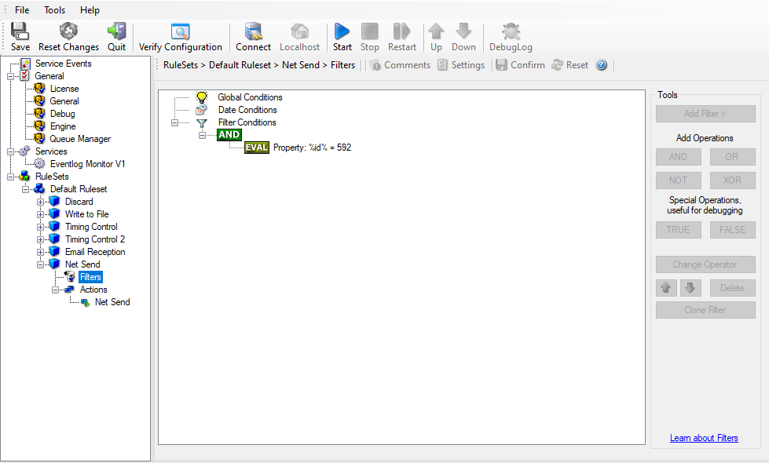
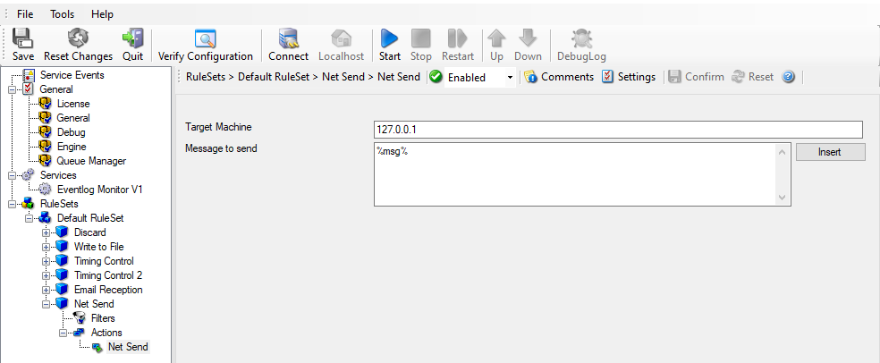
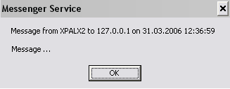

Alarming via Net Send
=====================

**Attention! Due changes in all supported Windows Version, the net send functionality has been disabled by default.**
**Using the Net Send Action will not work unless you enable certain policies on your Windows Installations.**

Again, we add another rule to our ruleset. This time, we would like to receive
notification via the Windows messenger service (aka "net send").

Please bear in mind that the Windows messenger service is not the instant
messaging service that many people nowadays associate with it. The messenger
service is meant for administrator notifications. If a windows workstation (or
server) receives a message via that service, a message box pops up on that
workstation and the user needs to press an "OK" button to continue. No
interaction is possible.

We create a new rule in our ruleset "Defaults". In this case, we assume that
we receive messenger notifications for all events with Event ID 592. In a real
use case, you make sure that this is a real important event, or chances are
good you become overwhelmed with messaging windows. A better example could be a
filter that checks for a server running low on disk space (using the disk space
monitor).

Alarming via Net Send - 1

This time, we use the "Net Send" action as can seen below. The target field holds
either the name or IP-Address of the workstation this message should be sending to.
The message text itself goes into "Message to send".

Alarming via Net Send - 2

After saving the configuration and restarting the MonitorWare Agent, we receive
notifications if the filter condition evaluates to true.
A sample message might look like this (slightly obscured in this sample):

Alarming via Net Send - 3
