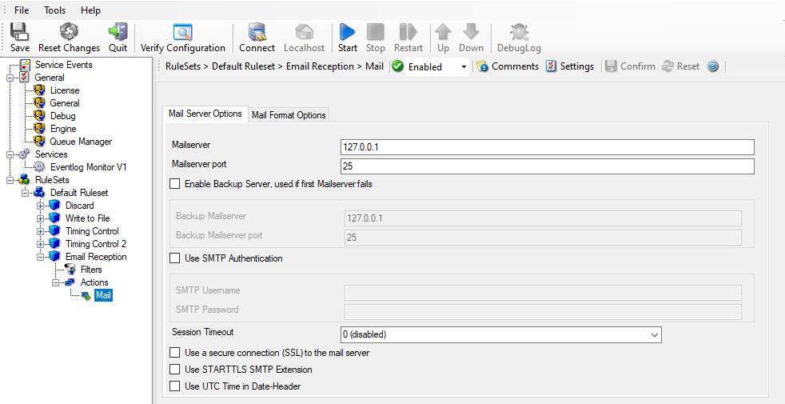
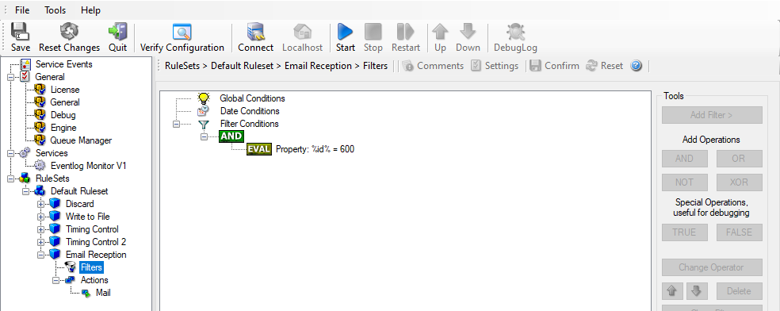

Email Notifications
===================

In this example, we would like to receive email notifications when certain
events happen.

So let us create an additional rule for that purpose: Right-click the "Default
ruleset" and select "Add Rule" from the pop up menu. Provide a name. We call
it "Email Reception" in this example. Then, chose below the "Forwarding
Actions": "Send Email".

In the action details, be sure to configure at least the mail server, recipient
and subject properties.

**Please note that many mail servers also need a valid sender mail address otherwise they deny the delivery of the message.**

Email Notifications - 1

Then, select the filter conditions. Let us assume we are just interested in
events of ID 600. Then the filter conditions should look as shown below:

Email Notifications - 2

When you have finished these steps, be sure to save the configuration and
restart the MonitorWare Agent service. After the restart, the newly extended
ruleset is executed. In addition, the rules defined so far, the new one is
carried out, emailing all events with ID 600 to the specified recipient.
