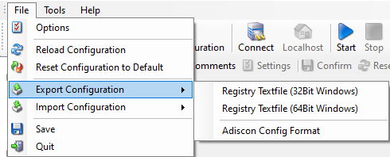

Menu Files
==========

Reload Configuration
--------------------

Update configuration from https url.

Reset configuration to Default
------------------------------

With this function you can reset the configuration to the default. All services,
configuration, and the license information will be deleted and set to default.

Export/Import Configuration
---------------------------

Here you can export/import the configuration in different formats.

* Export Configuration*

Registry Textfile (32 Bit Windows) / Registry Textfile (64 Bit Windows)
-----------------------------------------------------------------------

  Use this option if you want to transfer the settings via a registry file.
  Depending on your Windows system, choose Registry Textfile (32 Bit Windows) or
  Registry Textfile (64 Bit Windows).

These can be imported by double-clicking on the desktop, regedit.exe will be
automatically called.

Adiscon Config Format
---------------------

When working on a support incident, it is often extremely helpful to re-create a
customer environment in the Adiscon lab. To aid in this process, we have added
functionality to export an exact snapshot of a configuration. There are multiple
methods available. Adiscon Support prefers Adiscon Config Format. Please note
that when we have received your file, we are also able to make adjustments (if
needed) and provide those back to you. This is a very helpful support tool.

To use it, please do the following:

  1. Go to "File -> Export Configuration"

  2. Choose "Adiscon Config Format".

  3. Save the configuration file.

You may be reluctant to send the registry file because of security reasons. We
recommend you to review the contents of the registry file for security purposes
with a notepad or any other text editor.

**Please Note:** We have a 10 MB limit on our mail account. Please zip the registry

file and then send it to us. If the file size doesn't reduce after compressing
it you should contact Adiscon Support for further instructions.
