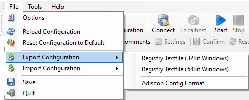

Menu Files
==========

Reload Configuration
--------------------

Update configuration from https url.

Reset configuration to Default
------------------------------

With this function you can reset the configuration to the default. All services,
configuration, and the license information will be deleted and set to default.

Export/Import Configuration
---------------------------

Here you can export/import the configuration in different formats.

* Export Configuration*

Registry Textfile (32 Bit Windows) / Registry Textfile (64 Bit Windows)
-----------------------------------------------------------------------

  This option is available for older workflows that require direct Windows
  Registry transfer. For support, backup, or moving a configuration between
  systems, prefer **Adiscon YAML Config Format**.

  If you intentionally need a registry file, choose the 32-bit or 64-bit
  registry text file option that matches your Windows system.

Registry files can be imported by double-clicking them. Windows starts Registry
Editor (``regedit.exe``) and writes the settings directly into the Windows
Registry.

Adiscon YAML Config Format
--------------------------

When working on a support incident, it is often extremely helpful to re-create a
customer environment in the Adiscon lab. To aid in this process, we have added
functionality to export an exact snapshot of a configuration. There are multiple
methods available. Adiscon Support prefers YAML configuration files because they
are readable and can be re-imported for analysis. Please note that when we have
received your file, we are also able to make adjustments (if needed) and provide
those back to you. This is a very helpful support tool.

To use it, please do the following:

  1. Go to "File -> Export Configuration"

  2. Choose "Adiscon YAML Config Format".

  3. Save the configuration file.

You may be reluctant to send the exported file because of security reasons. We
recommend that you review the contents of the file with Notepad or another text
editor before sending it.

**Please Note:** We have a 10 MB limit on our mail account. Please zip the
exported file and then send it to us. If the file size doesn't reduce after
compressing it you should contact Adiscon Support for further instructions.
