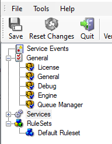
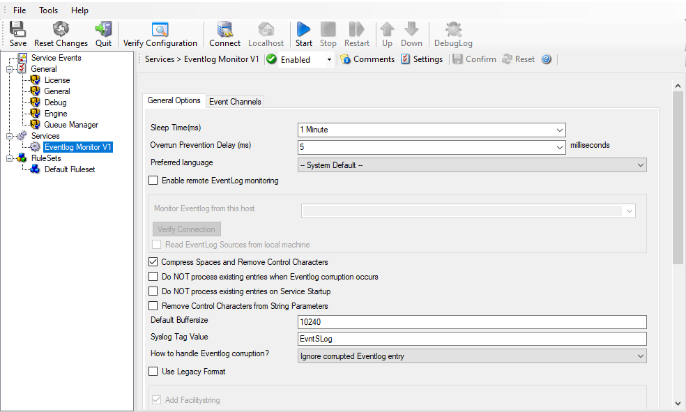
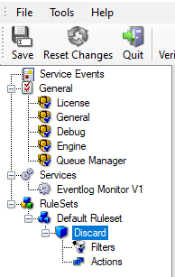
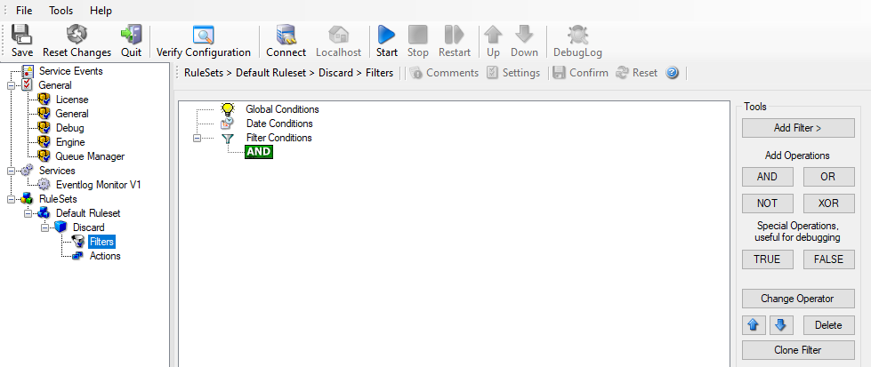
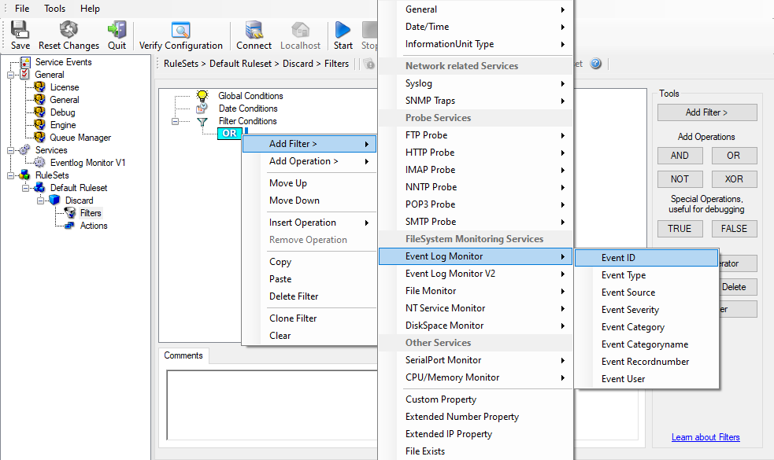
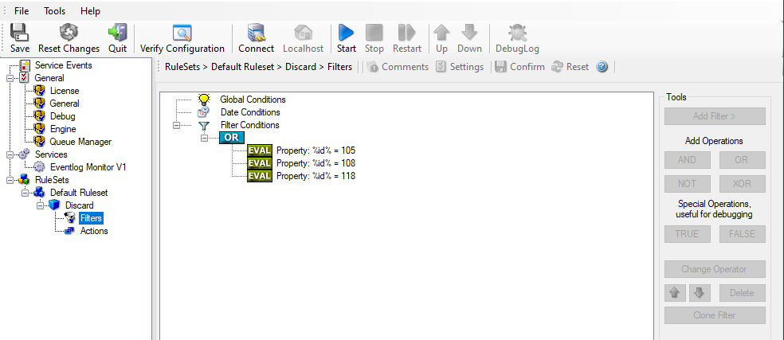
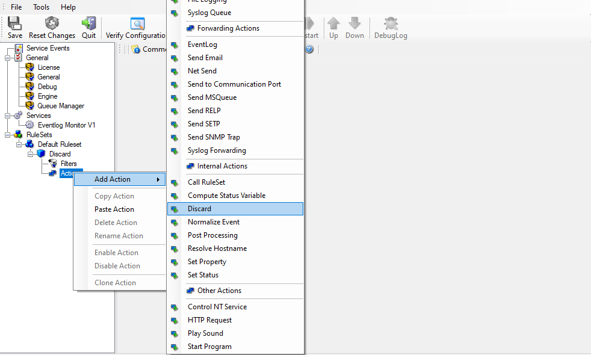

Ignoring Events
===============

There are some events which occur often and you do not want them to be stored
in your log files or either take any action on those.

We handle these events on top of our ruleset. This ensures that only minimal
processing time is needed and they are discarded as soon as possible.

In this tutorial, we define a filter that discards such events. In our example,
we assume that Events with the ID 105, 108, and 118 are not required. Please
note that for simplicity reasons we only apply filter based on the event ID. In
a production environment, you might want to add some additional properties to
the filter set.

In this sample, no service or ruleset has yet been defined. It is just a
"plain" system right after install.

We start by defining a ruleset. Right-click on "RuleSets" and choose "Add
RuleSet" from the context menu. Enter a name of your choice. In this tutorial,
we use the name "Default RuleSet". Click on "Next". Leave everything as it is
in the next dialog. Click "Next", then "Finish". As can be seen in following
screen shot, the ruleset "Default" has been created but is still empty.

* Ignoring Events - 1*

Of course we can only use a rule if we configure a corresponding service. To do
so, right-click on "Running Services" and then select "Add Services". Choose
the desired "Service" from the context menu i.e. "Event Log Monitor" in this
sample. Provide a name of your choice. In our sample, we call the service
"Event Log Monitor". Leave all defaults and click "Next", then "Finish". Now
click on "Event Log Monitor" under "Running Services". Your screen should look
as follows:

* Ignoring Events - 2*

As we had created the "Default" ruleset initially, it is shown as the rule
set to use for this service. For our purposes, that is correct. To learn more
on the power of ruleset assignments, see other sections of this manual.

Now we do something with the data that is generated by the Event Log Monitor.
To do so, we must define rules inside the ruleset.

In the tree view, right-click "Defaults" below "RuleSets". Then, click "Rules",
select "Add Rule". Choose any name you like. In our example, we call this rule
"Discard". Then, expand the tree view until it looks like the following
screenshot:

* Ignoring Events - 3*

Click on "Filter Conditions" to see this dialog:

* Ignoring Events - 4*

In that dialog, we define our filter. Remember: we are about to filter those
events, which we are not interested in. As we would like to discard multiple
events, we need the Boolean "OR" operator in the top-level node, not the
default "AND". Thus, we need to change the Boolean operator.

There are different ways to do this. Either double-click the "AND" or click
"Change Operator" - you find it below tools on the right side - to cycle
through the supported operations. In any way the Boolean operation should
be changed to "OR".

We filter out "uninteresting" events via their event id. Again, there are
different ways to do this. You may use the Tools at the right side to click
the "Add filter" button. In the sample, we do it via right-clicking the "OR"
node and selecting "Add Filter" from the pop up menu. This can be seen in
the screen shot below:

* Ignoring Events - 5*

I prefer to add all three Event ID property filters first and later on change
the Event ID to the actual value I am looking for.

In order to enter the actual values, select each of the three filters. A small
dialog opens at the bottom of the screen. There you enter the values you are
interested in. In our sample, these are IDs 105, 108, and 118. As we are only
interested in exactly these values, we do a comparison for equality, not one of
the other supported comparison modes. When you have made the updates, you
screen should look as follows:

* Ignoring Events - 6*

Save the settings by clicking the (diskette-like) "Save" button. We have now
selected all events that we would like to be discarded. In reality, these are
often far more or a more complicated filter is needed. We have kept it simple
so that the basic concept is easy to understand – but it can be as complex as
your needs are.

Now let us go ahead and actually discard these events. This is done via an
action. To do so, right-click on "Actions" and select "Discard."

Again, name the action as you like in the following dialog. We use "Discard" as
this is quite descriptive.

* Ignoring Events - 7*

This concludes the definition of our first rule.

If we would start MonitorWare Agent service now, all events with IDs 105, 108
and 118 would be handled by this rule and thus be discarded. All other events
do not cause the filter condition to evaluate to true and thus those would be
left untouched. Consequently, only these other events flow down to rules
defined behind the "Discard" rule. Obviously, our configuration effort is not
yet completed. We just finished a first step, excluding those events that we
are not interested in. And of course, in reality you need to decide which ones
to discard in a real ruleset.
