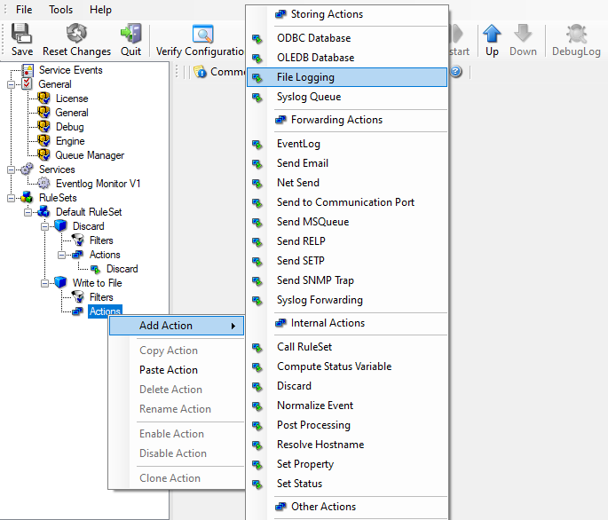

Logging Events
==============

Often, a broad range of events (or information units as we call them) needs to
be stored persistently so that you can review and analyze them if the need
arises. As such, we are in need of a rule that persists the events. In our
sample, we choose to work with a text log file (not a database, which we also
could use). We now create a rule to store all those events not discarded by the
previous rule into a log file.

To do so, right-click the "Defaults" ruleset as shown below. Then, select
"Rules" and "Add Rule":

.. image:: ../../images/loggingevents_1.png
   :width: 30%

* Logging Events - 1*

Use a name of your choice. In our sample, we call this rule "Write to
File". This rule should process all events that remained after the initial
discard rule. As such, we do not need to provide any filter condition (by
default, the filter condition matches always).

Since we want to store all still open Events with help of this rule, we do not
require any filter rules here. However, a corresponding action must be defined.
Therefore, we just need to define the action:

To do so, expand "Write to File" and right-click "Actions". Select "Add
Action", then "File Logging" as can be seen below:

* Logging Events - 2*

Do not modify the defaults. In our sample, we call this action "File Logging".
Now the tree view contains a node "File Logging", which we select:

.. image:: ../../images/a-filelogging-filenamerelated.png
   :width: 100%

* Logging Events - 3*

Important
---------

If the configured directories are missing, they are automatically created by
MonitorWare Agent i.e. the folder specified in "File Path Name".

In our sample, we change the file base name to "logdata". This was just done out
of personal preference. There is no need to do so, but it may be convenient for
a number of reasons.

Summary
-------

What did we do so far?  All events from the Windows Event Log are passed
through our rule engine and rule filters. Certain events are discarded and the
remaining events are stored to a text file on the local disk (for later review
or post-processing).

We can now do a quick test: Start MonitorWare Agent by hitting the start button
seen below:

* Logging Events - 4*

The log file should be created in the path you have specified. Open it with
notepad. You should see many events originating from the event log. When you
re-open the log file, new events should appear (if there were any new events in
the Windows Event Log). The file is not easily readable. Most probably, you
have created it for archiving purposes or to run some external scripts against
it. For review, we recommend to try free `Adiscon Loganalyzer <http://loganalyzer.adiscon.com/>`_ open source
project.

**Please note that the current date is appended to the log file. This facilitates**
**file management in archiving. The format is "logdata-YYYY-MM-DD.log".**

You have now learned to define rules and actions. The following chapters thus
does not cover all details of this process. If in doubt, refer back to these
chapters here.
