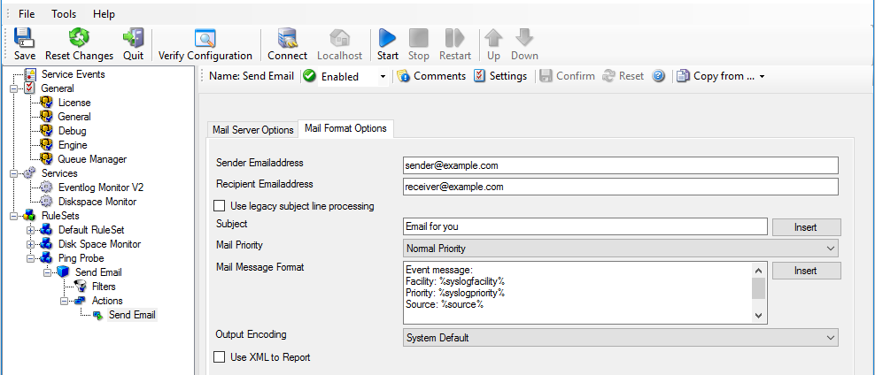
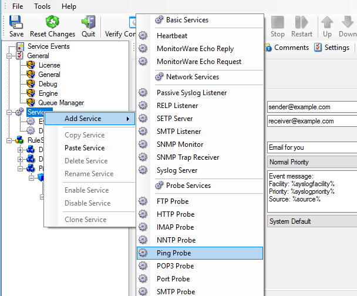
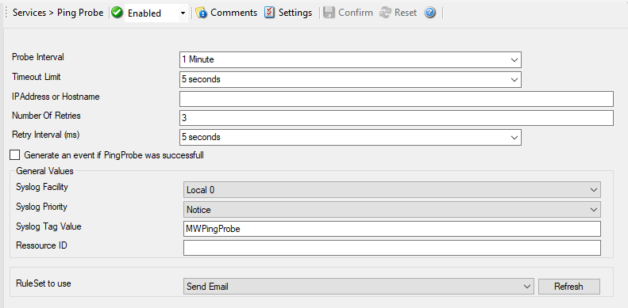

Monitoring External Devices via PING
====================================

In this sample, we use the ping probe to monitor the availability of external
devices. The ping probe issues a standard IP "PING". Each system that is
"pinged" provides a reply to the system initiating the ping. When the reply
comes back, the initiator knows that the pinged system is up and running.

**Please note that this does not imply that all services on that machine are**
running.** To check this, a port probe must be used.

At least the ping probe can detect failing systems. The Ping Probe can be used
in any case, whereas the port probe only can be used with tcp based services.

As first step, we create a new ruleset. Please see the previous example for
the reasoning of doing so. We call the new ruleset "Send Email". We would like
to receive email notifications if the ping probe fails. So we add a "Send
Email" action. After doing so, the screen looks as follows:

* Monitoring External Devices via PING - 1*

**Please note we do not customize the Send Email action properties in this**
sample. In your environment, you need to use some meaningful settings.**

Now that we have defined the ruleset, we need to create the corresponding
service. To do so, right-click "Running Services" and follow the screen shot
below:

* Monitoring External Devices via PING - 2*

Use a name of your choosing, leave the defaults as is, click "Next", and then
"Finish". We have used the name "Ping Probe" in our sample.

Click the newly created service. We need to uncheck the "Generate an event if
Ping Probe was successful" check box. If it is checked, an event is generated
every time. If unchecked, it is generated only when the ping fails. As we are
just interested in failed systems, we uncheck it. Therefore, we do not need to
apply any other filters. If you forget to uncheck this option, you receive
multiple emails – one each time the Ping Probe runs and probes the configured
system.

You screen should now look as follows:

* Monitoring External Devices via PING - 3*

Now save the settings and restart the service. Whenever the Ping Probe fails,
you receive a mail. This mail looks as follows:

.. code-block:: text

  Event message:
  Facility: 16
  Priority: 6
  Source: 172.19.0.1

  Message:
  PingProbe Status="error" remoteip="172.19.0.1" PingStatus="11003"
  ErrorMessage="Destination Host Unreachable"

A ping probe service can monitor a single device in this version of MonitorWare
Agent. Therefore, if you would like to monitor multiple devices, you need to
create multiple ping probe services.
