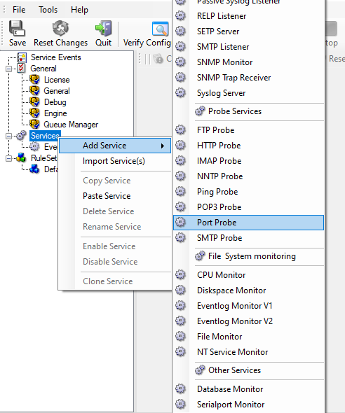
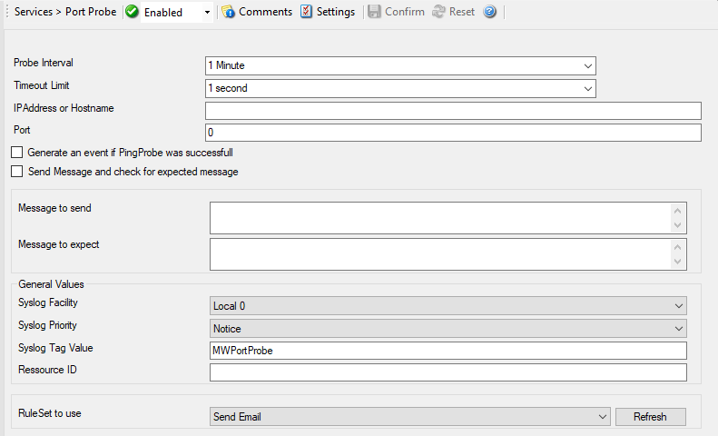

Monitoring External Devices via a Port Probe
============================================

This sample is very similar to the ping probe sample directly above. Thus, we
describe it briefly, only.

The main difference between the ping probe and the port probe is that the port
probe tries to connect to a specific TCP port. As such, it can only be used
with TCP based services like mail server, web servers, or ftp servers. For the
very same reason, the port probe does not only check the status of the machine
it is connecting to but rather if a specific, **service** is available. Let us
assume you are interested in monitoring a mail server. If you do a ping probe,
the mail server itself might have died while the machine is still running. The
ping probe cannot detect this. The port probe, on the other hand, directly
connects to the mail server, e.g. on port 25 (the default SMTP port). If the
mail server has died, it will probably not answer this connection request and
thus the port probe is able to detect the failing state of the service.

In our sample, we probe a web server, which typically listens to port 80 (the
default port for http). We will send an email alert if the port probe cannot
connect successfully to the web server.

Because this sample is so close to the previous one, we do not create a new
ruleset specifically for email alerting. It is already covered in the "Ping
Probe". This is a good example of ruleset reuse. If necessary, rename the
ruleset in such a case. For simplicity reasons, we have not done this here.

Therefore, we begin by creating the new service, done by right-clicking
"Services":

* Monitoring external devices via Port Probe - 1*

After doing so, select the newly created service in the tree view to look at
its properties. Be sure to bind it to the "Send Email" ruleset as seen below:

* Monitoring external devices via Port Probe - 2*

Save the configuration and restart the service. From now on, the following mail
alert will be generated when the port cannot be connected to:

.. code-block:: text

  Event message:
  Facility: 16
  Priority: 6
  Source: 192.168.1.1

  Message:
  PortProbe status="fail" target="192.168.1.1" port="80"
  netstate="10065" message="Couldn't connect to host"
