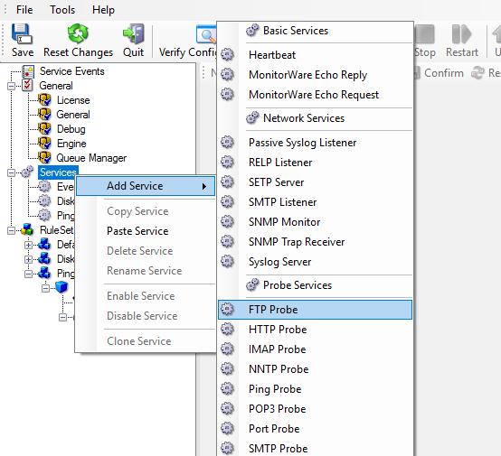
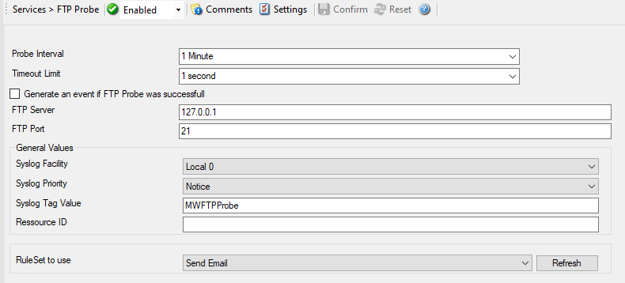

Monitoring FTP Server via an FTP Probe
======================================

This sample is very similar to the Ping Probe and Port Probe samples.
Thus, we describe it briefly, only.

FTP Probe is used to make a connection to the FTP server. Then it receives
the response from FTP server and sends the QUIT command to terminate the
connection. The connection status is saved in the property **ftpstatus** and the response in the property **ftprespmsg**.

In our sample, we probe a FTP server, which typically listens to port 21 (the
default port for FTP). We send an email alert if the FTP probe cannot connect
successfully to the FTP server.

Because this sample is so close to the previous ones, we do not create a new
ruleset specifically for email alerting. Please view "Ping Probe" for it. This
is a good example of ruleset reuse. If necessary, rename the ruleset in such
a case. For simplicity reasons, we have not done this here.

Therefore, we begin by creating the new service, done by right-clicking
"Services":

* Monitoring FTP Server via an FTP Probe - 1*

After doing so, select the newly created service in the tree view to look at
its properties. Be sure to bind it to the "Send Email" ruleset as seen below:

* Monitoring FTP Server via an FTP Probe - 2*

Save the configuration and restart the service. From now on, the following mail
alert is generated when the port cannot be connected to:

.. code-block:: text

  Event message:
  Facility: 16
  Priority: 6
  Source: 192.168.1.1

  Message:
  FTPProbe status="fail" target="192.168.1.1" port="21"
  netstate="10061" message="Couldn't connect to host"
