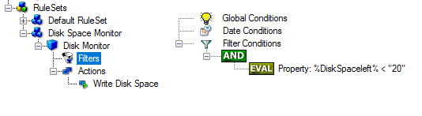
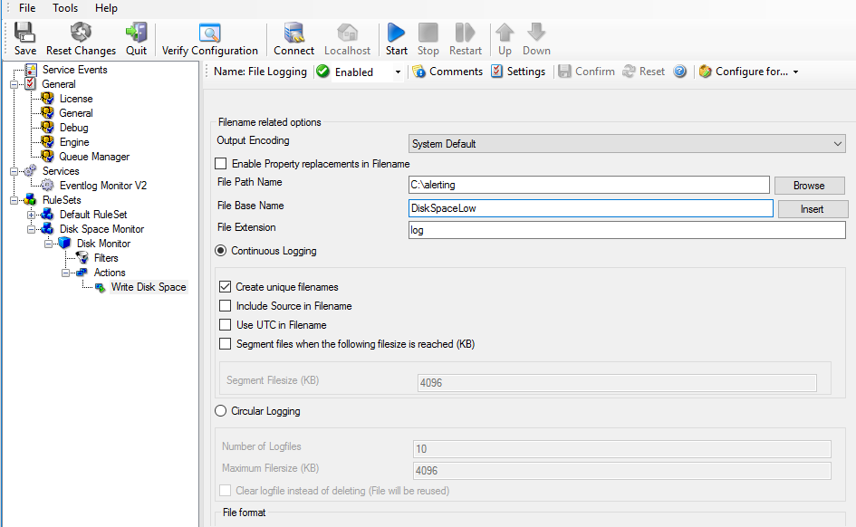
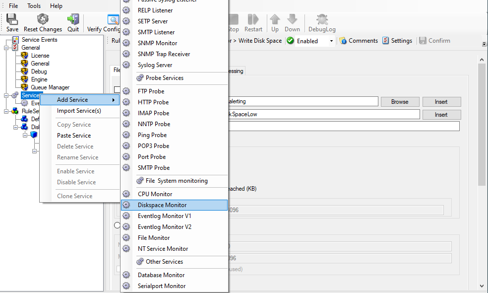
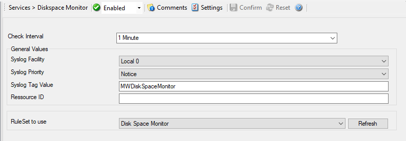
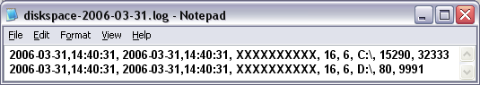

Monitoring Diskspace
====================

Monitoring disk space solves at least two purposes: it can be used to
generate alerts or trigger corrective actions if a system runs out of free
space. It can also be used as a statistical tool to monitor disk space
utilization over time.

In our tutorial, we configure a simple diskspace monitor and define a rule
that stores the results into a text file that can be analyzed later. Of course,
we could have added trigger conditions for alerts and such. We have not done
this, to keep things simple.

As always, we create the needed ruleset first. In our sample, we call it
"Disk Space".

**Please note that this time we actually create a "RuleSet", not just an**
additional rule in the "Defaults" ruleset.** The reason is that for our
purpose, it is much easier to define a specialized ruleset and then bind this
specialized ruleset to the disk space monitor. If we would use the generic
"Defaults" ruleset, we had to make sure that our filter conditions would only
match when an event of type disk space monitor would come in. In addition, it
would require more processing time, as all rules and condition filters would be
processed – a process that is not needed as we deal with a specific case. As
such, it is more appropriate to define a specific ruleset, which is then only
used for the disk space monitor. What is appropriate in your environment
depends on your needs. There is no general rule.

Inside the new rule, we create a filter condition that evaluates to true only
if the reported diskspace has less than 20 gigabytes of free space. So we log
date only when we potentially have constrained disk space. The filter looks as
follows:

* Monitoring Diskspace - 1*

To create this filter, select "Diskspace Monitor", then "Disk Space Left" when
pressing the "Add Filter" button.

We use the "Write to File" action in this sample. The action is called
"Write DiskSpace" as can be seen below. We could also have used other actions,
including emailing, to alert an administrator or start a script to delete temporary
files.

* Monitoring Diskspace - 2*

**Please note: you should make sure that the base name is different from other**
"write to file" actions. Otherwise data might get mixed up in the files.**

Having created the new ruleset, we now need to create the disk space monitor
service itself. It is the part of the software that actively goes out and
monitors the disk space. To create it, right-click "Services" and
select "Add Service". Below "File System monitoring" you find "Diskspace Monitor"
as seen below:

* Monitoring Diskspace - 3*

We name the service "Disk Space Monitor" in our sample. Leave the default settings.
**Please note that when you select the new service, it is typically bound to the**
"Defaults" ruleset. We need to change this, as we have created the specific
"Disk Space Monitor" ruleset. Change the "RuleSet to Use" to
update it to the new binding.**

* Monitoring Diskspace - 4*

Save the configuration and restart the service. After a few moments, the disk
space log file should fill up (**if there is less than 20 GB of free space on the monitored system**). In notepad, it looks like follows:

* Monitoring Diskspace - 5*
