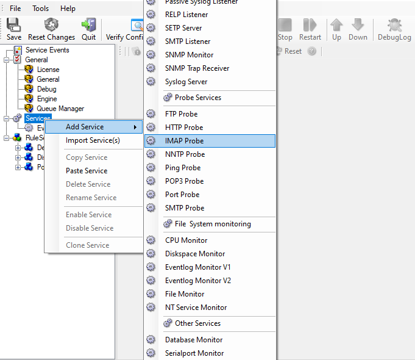
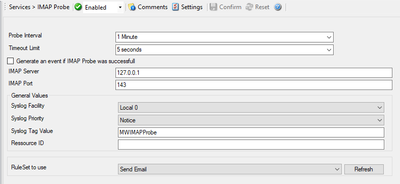

Monitoring IMAP Server via a IMAP Probe
=======================================

IMAP probe is used to make a connection to the IMAP server. Then it receives
the response from IMAP server and sends the QUIT command to terminate the
connection. The connection status is saved in the property **imapstatus** and the response in the property **imaprespmsg**.

In our sample, we probe an IMAP server, which typically listens to port 143 (the
default port for IMAP). We send an email alert if the IMAP probe cannot connect
successfully to the IMAP server.

Because this sample is so close to the previous ones, we do not create a new
ruleset specifically for email alerting. Please view "Ping Probe" for it. If
necessary rename the ruleset in such a case. For simplicity reasons, we have not
done this here.

Therefore, we begin by creating the new service, done by right-clicking
"Services":

* Monitoring IMAP Server via an IMAP Probe - 2*

After doing so, select the newly created service in the tree view to look at
its properties. Be sure to bind it to the "Send Email" ruleset as seen below:

* Monitoring IMAP Server via an IMAP Probe - 1*

Save the configuration and restart the service. From now on, the following mail
alert is generated when the port cannot be connected to:

.. code-block:: text

  Event message:
  Facility: 16
  Priority: 6
  Source: 192.168.1.1

  Message:
  IMAPProbe status="fail" target="192.168.1.1" port="143"
  netstate="10061" message="Couldn't connect to host"
