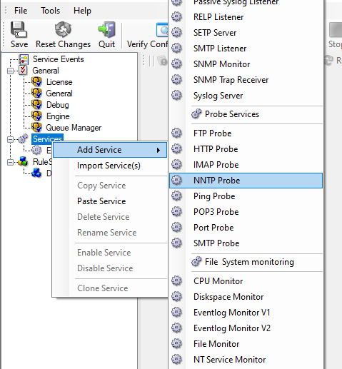

Monitoring NNTP Server via a NNTP Probe
=======================================

NNTP probe is used to make a connection to the NNTP server and then it receives
the response from NNTP server and sends the QUIT command to terminate the
connection. The connection status is saved in the property **nntpstatus** and the response in the property **nntprespmsg**.

In our sample, we probe a NNTP server, which typically listens to port 119 (the
default port for NNTP). We send an email alert if the NNTP probe cannot connect
successfully to the NNTP server.

Because this sample is so close to the previous ones, we do not create a new
ruleset specifically for email alerting. Please view "Ping Probe" for it. If
necessary rename the ruleset in such a case. For simplicity reasons, we have not
done this here.

Therefore, we begin by creating the new service, done by right-clicking
"Services":

* Monitoring NNTP Server via an NNTP Probe - 1*

After doing so, select the newly created service in the tree view to look at
its properties. Be sure to bind it to the "Send Email" ruleset as seen below:

* Monitoring NNTP Server via an NNTP Probe - 2*

Save the configuration and restart the service. From now on, the following mail
alert is generated when the port cannot be connected to:

.. code-block:: text

  Event message:
  Facility: 16
  Priority: 6
  Source: 192.168.1.1

  Message:
  NNTPProbe status="fail" target="192.168.1.1" port="143"
  netstate="10061" message="Couldn't connect to host"
