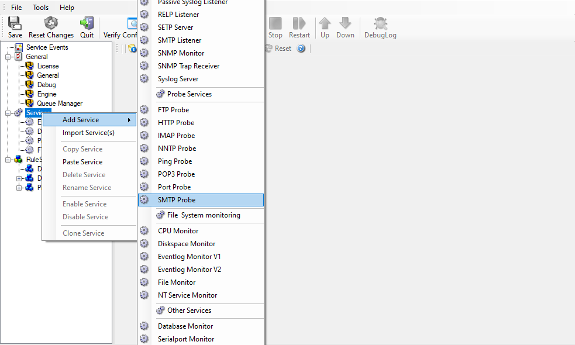
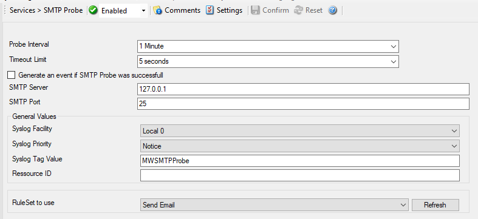

Monitoring SMTP Server via a SMTP Probe
=======================================

This sample is also very similar to the ones directly above. Thus, we describe
it briefly, only.

SMTP probe is used to make a connection to the SMTP server. Then it receives
the response from SMTP server and sends the QUIT command to terminate the
connection. The connection status is saved in the property **smtpstatus** and the response in the property **smtprespmsg**.

In our sample, we probe a SMTP server, which typically listens to port 25 (the
default port for SMTP). We send an email alert if the SMTP probe cannot connect
successfully to the SMTP server.

Because this sample is so close to the previous ones, we do not create a new
ruleset specifically for email alerting. Please view "Ping Probe" for it. If
necessary rename the ruleset in such a case. For simplicity reasons, we have not
done this here.

Therefore, we begin by creating the new service, done by right-clicking
"Services":

* Monitoring SMTP server via a SMTP Probe - 1*

After doing so, select the newly created service in the tree view to look at
its properties. Be sure to bind it to the "Send Email" ruleset as seen below:

* Monitoring SMTP server via a SMTP Probe - 2*

Save the configuration and restart the service. From now on, the following mail
alert is generated when the port cannot be connected to:

.. code-block:: text

  Event message:
  Facility: 16
  Priority: 6
  Source: 192.168.1.1

  Message:
  SMTPProbe status="fail" target="192.168.1.1" port="25"
  netstate="10054" message="Receive call failed"
