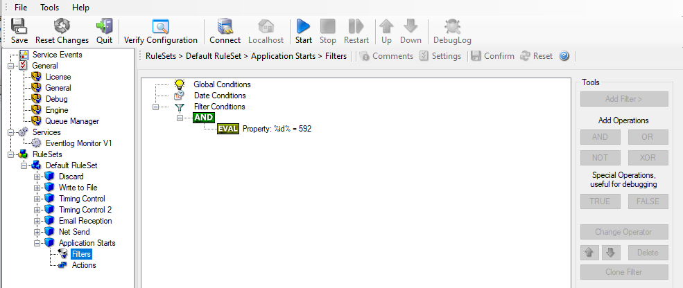
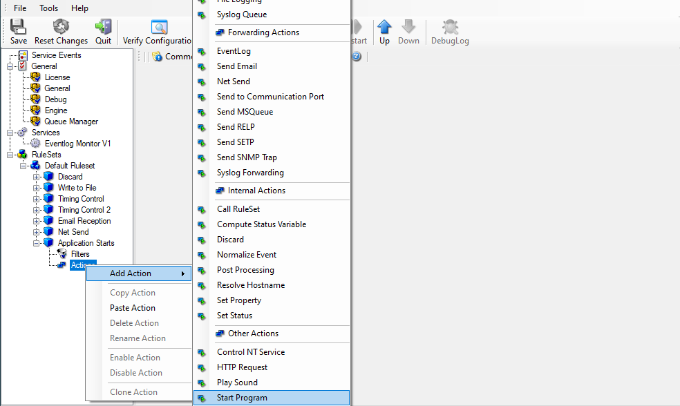
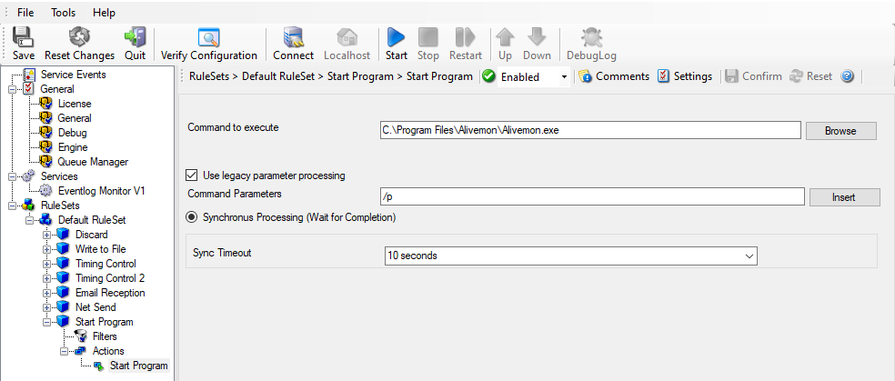

Starting Scripts and Applications in Response to an Event
=========================================================

We now want to start an application or a script when certain events occur.
Typically, this is done to start administrative scripts or corrective action.
For example, if a disk runs low on space, you could start a script that deletes
temporary files, or if a service fails, a script could restart it.

Our sample, on the other hand, is kept quite simple again. We just show how to
generically start an exe file. To do so, we define a new rule named
"Application starts". Again, we use the imaginary event 592 as a filter
condition. Therefore, the application starts whenever event 592 comes in.

* Starting Scripts and Applications in Response to an Event - 1*

The start program action is just a "normal" action:

* Starting Scripts and Applications in Response to an Event - 2*

In the "Start Program" action's parameters select the file to run. Also all
parameters need to be supplied to it (if any):

* Starting Scripts and Applications in Response to an Event - 3*

Once this configuration is done, the program is executed as soon as an event
matching the filter condition comes in.
