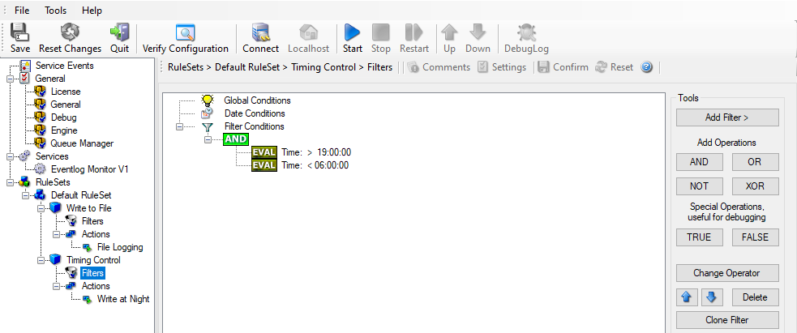
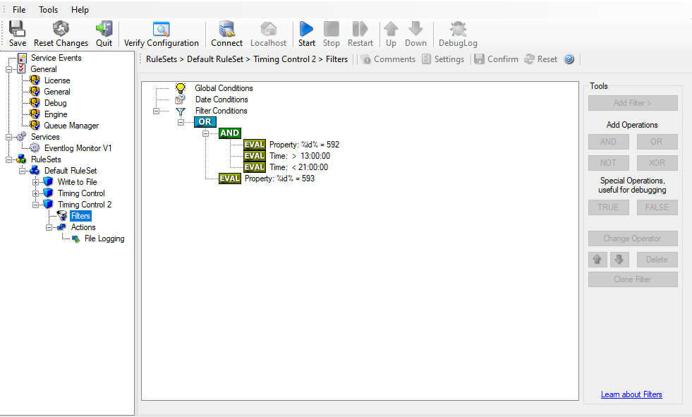

Time-Based Filters
==================

Time-based filters are especially useful for notifications. For example, a user
login is typically a normal operation during daytime, but if there are no night
shifts, it might be worth generating an alert if a user logs in during night
time. Another example would be a backup run that routinely finishes during the
night. If we see backup events during the day, something might be wrong.

Similarly, there are a number of other good reasons why specific actions should
only be applied during specific time frames. Fortunately, MonitorWare Agent
allows defining complex time frames. In this tutorial, though, we focus on the
simple ones.

Let us first define a sample time-based filter that applies a nightly time
frame. In fact, there are many ways to do this. We have used the method below,
because it is straightforward and requires the least configuration work.

To make matters easy, we use this filter condition just to write nightly event
log data to a different log file. In reality, time-based filters are often
combined with other conditions to trigger time based alerts. However, this
would complicate things too much to understand the basics.

In the sample below, an additional rule called "Timing Control" has been added.
It includes a time-based filter condition. Only if that condition evaluates to
"true", the corresponding action is executed. This action can be "Write to
Database" or "Write to File". Here we had selected "Write to File" action and
renamed it as "Write at Night".

**Please note: we use the 24-hour clock system.**

* Time-Based Filters - 1*

All events generated by services binding to our ruleset "Defaults" are now
also be passed along the "Timing Control" ruleset. If these events come in
night times between ``19:00:01`` and ``5:59:50``, the action "Write at Night" is executed.

**Please note that the use of the "OR" operator is important because either one of the time frames specified does apply. This is due to the midnight break.**

If an event comes in at ``08:00:00 AM`` in the morning, the action is not called – it is outside of the specified time frame:

.. code-block:: text

  08:00:00 > 19:00:00 = false
  08:00:00 < 06:00:00 = false

If the very same event comes in at ``20:00:00`` it evaluates to true and the action is executed.

.. code-block:: text

  20:00:00 > 19:00:00 = true
  20:00:00 < 06:00:00 = false

As stated earlier, time frames are most often used in combination with other
filters. Here is a more complex example:

* Time-Based Filters - 2*

In this example, we call the configured actions if events with ID 592 occurs
between``13:00:01`` and ``20:59:59`` (roughly ``21:00:00``). We also execute the configured actions if event ID 593 occurs. Please note that in the case of 593 events, the
time filter does not apply due to the used Boolean operations.

In this sample, you also notice that we use an "AND" condition to build the
time frame. The reason is that there is no implicit midnight boundary for our
time frame as was in the first sample. As such, we need to employ "AND" to make
sure the events are WITHIN the specified range.

Now let us look at some sample data:

We receive a 592 event at ``07:00:00`` sharp:

.. code-block:: text

  Event ID = 592          = true
  07:00:00 > 13:00:00     = false
  07:00:00 < 21:00:00     = false
  "AND" Branch            = false
  Event ID = 593          = false

In all, the filter condition is false.

Now, the same event comes in at ``14:00:00``:

.. code-block:: text

  Program start ID = 592  = true
  Event ID = 592          = true
  14:00:00 > 13:00:00     = true
  14:00:00 < 21:00:00     = true
  "AND" Branch            = true
  Event ID = 593          = false

This time, the time frame is correct, yielding to an overall true condition
from the "AND" branch. That in turn yields to the filter condition as whole to
evaluate to true.

In this example still is another Event ID. All events with event ID 593 are
grasped. This happens independently from the timing control when grasping the
Events 592.

One last sample. At this time, event 593 comes in at ``07:00:00``:

.. code-block:: text

  Program start ID = 593  = true
  Event ID = 592          = false
  07:00:00 > 13:00:00     = false
  07:00:00 < 21:00:00     = false
  "AND" Branch            = false
  Event ID = 593          = true

This time the filter condition evaluates to true, too. The reason is that the
(not matched) time frame is irrelevant as the other condition of the top-level
"OR" branch evaluates to true (Event ID = 593).
