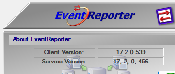
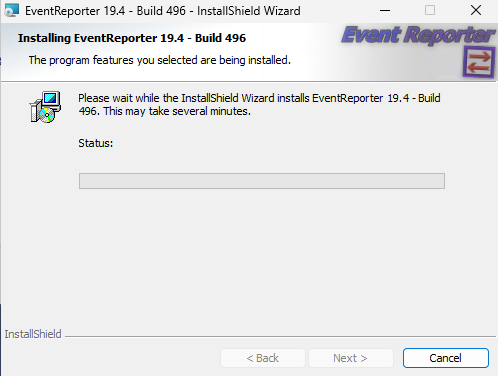
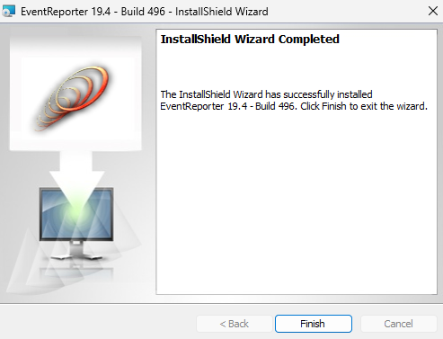
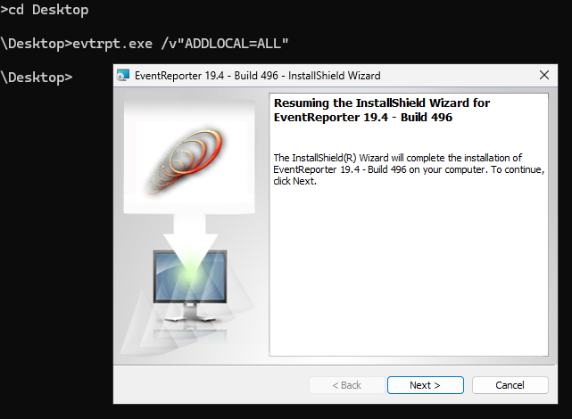
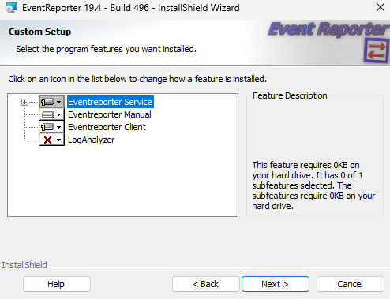
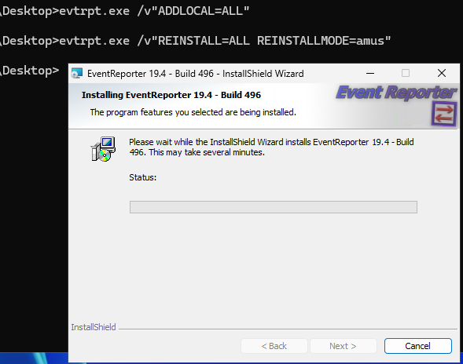
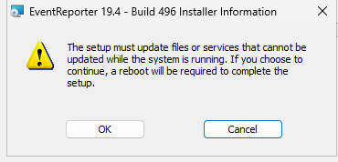
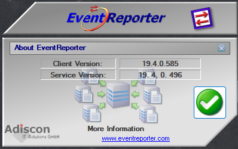
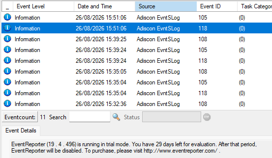

:orphan:

.. rubric:: Representative setup evidence

The screenshots below come from one affected setup run and are representative
of the visual clues described in this article. Product names, component labels,
and version numbers can differ in other product installations.

   The installed product reports the older client and service versions before
   the update.

   The setup wizard can display a normal installation-progress page.

   The wizard can report that the installation completed successfully.

   A later maintenance action can resume the InstallShield wizard.

   Custom Setup can show an unexpected feature state, such as zero selected
   subfeatures or zero required disk space.

   A second maintenance run can reinstall the selected product files.

   Files or services that remain in use can cause the installer to request a
   reboot.

   After a successful file refresh, the client and service report the newer
   versions.

   Verify the running product after the installer finishes.
