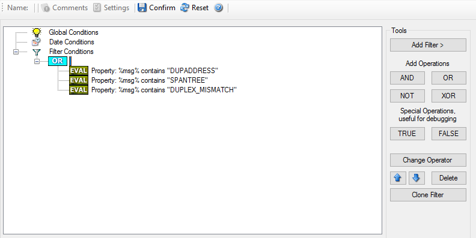
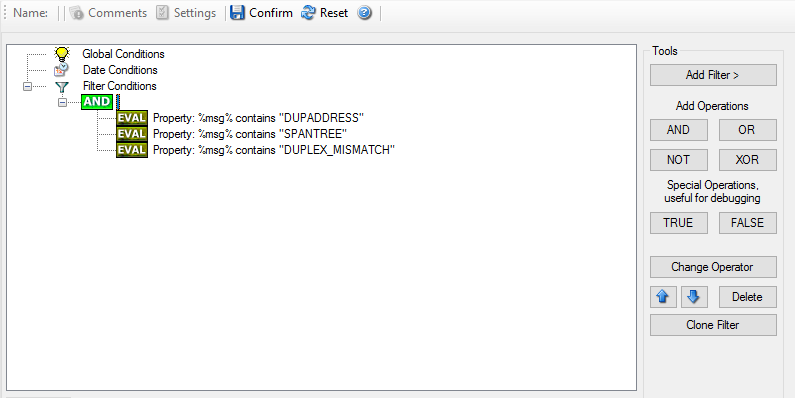
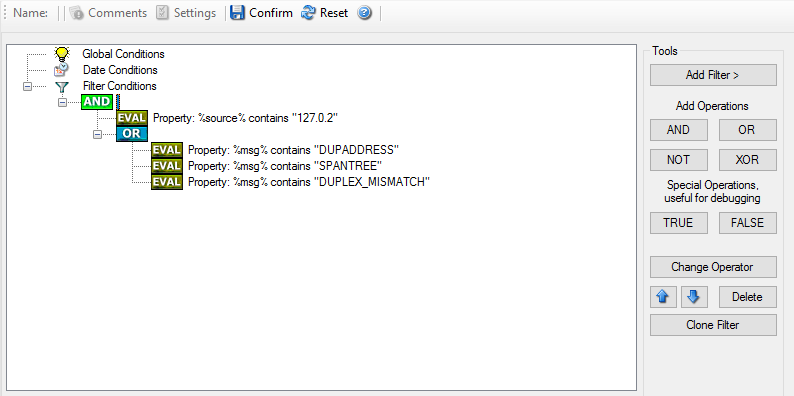
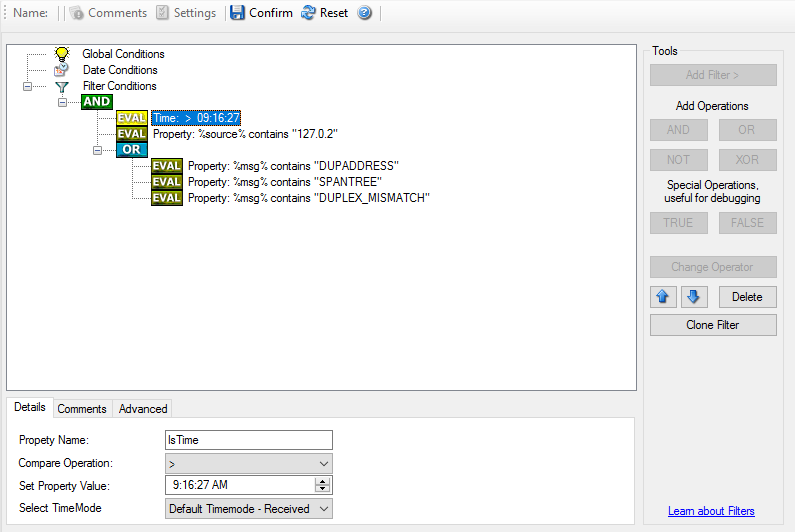

.. index:: Complex Filter Conditions

Complex Filter Conditions
=========================

The rule engine uses complex filter conditions.

Powerful boolean operations can be used to build filters as complex as needed.
A boolean expression tree is graphically created. The configuration program is
modeled after Microsoft Network Monitor. So thankfully, many administrators
are already used to this type of Interface. If you are not familiar with it,
however, it looks a bit confusing at first. In this chapter, we are providing
some samples of how boolean expressions can be brought into the tree.

Example 1
---------

In this example, the message text itself shall be checked. If it contains at
least one of three given strings, the filter should become true. If none of the
string is found, the boolean expression tree evaluates to false, which means
the associated action(s) will not be executed.

In pseudo-code, the filter could be written like this:

``If (msg  = "DUPADDRES") OR (msg = "SPANTREE") OR (msg = "DUPLEX_MISMATCH) then``

  ``execute action(s)``

``end if``

Please note: in the example, we have abbreviated "message" to just "msg". Also
note that for brevity reasons we use the equals ("=") comparison operator,
not the contains. The difference between the equals and the contains operator
is that with "contains", the string must just be part of the message.

In the filter dialog, this pseudo code looks as follows:

Figure 1 - Example 1

Example 2
---------

Example 2 is very similar to example 1. Again, the message content is to be
checked for three string. This time, all of these strings must be present in
order for the boolean tree to evaluate to false.

The pseudo code would be as follows (under the same conditions outlined in
example 1 above):

``If (msg  = "DUPADDRES") AND (msg = "SPANTREE") AND (msg = "DUPLEX_MISMATCH) then``

  ``execute action(s)``

``end if``

In the filter dialog, this pseudo code looks as follows:

Figure 2 - Example 2

Example 3
---------

This example is a bit more complex version of example 1. Again, the same
message text filtering is done, that is if any one of the provided substrings
is present, the filter eventually evaluates to true. To do so, the source
system must also contain the string "192.0.2", which can be used to filter on a
device from a specific subnet.

An example like this can be used for a rule where the administrator of a
specific subnet should be emailed when one of the strings indicate a specific
event.

The pseudo code would be as follows (under the same conditions outlined in
example 1 above):

``If ((sourceSys = "192.0.2") And``
   ``((msg  = "DUPADDRES") OR (msg = "SPANTREE")``
                           ``OR (msg = "DUPLEX_MISMATCH))) then``

  ``execute action(s)``

``end if``

In the filter dialog, this pseudo code looks as follows:

Figure 3 - Example 3

As a side note, you may want to use a range check instead of a simple include
for the source system. With a range string check, you can specify that the
string must be within a specified column range, in this case obviously at the
beginning of the source system IP address.

Real-World Examples
-------------------

To see some real-world examples of where boolean conditions inside filtering
are used, please visit these web links:

•  `Detecting Password Attacks under Windows <https://www.adiscon.com/article/detecting-password-attacks-on-windows/>`_

Example 4
---------

In this example, the report is to be filtered in such a way that it shows
information only in the case, if the time is greater then certain time with
certain event source and one of two event ID's.

In pseudo-code, the filter could be written like this:

``If (DeviceReportedTime is greater than {9:16:27} AND EventSource is equal to``
``{Print} AND [EventID is equal to {10} OR EventID is equal to {18}]]``

In the filter dialog, this pseudo code looks as follows:

