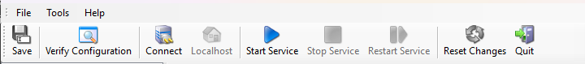
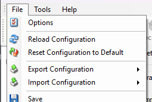
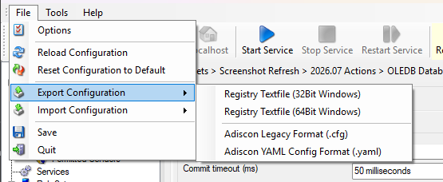

:orphan:

.. _configuration-client-2026:

Configuration client (2026 release line)
========================================

The **2026.07** installer ships two configuration clients:

- **Established configuration client** — the WinForms client documented in this
  manual (primary reference for setup steps and screenshots).
- **Next-generation Configuration Client Preview** — a WinUI-based workbench
  (``adiscon-client-ng``), shipped as a **preview** alongside the classic client.

The preview is optional. The classic client supports License V2 deployment and
full configuration editing for the 2026 major. See your product website's 2026
major-release **Upgrade** article for the customer-facing preview description.

Property window toolbar
-----------------------

When you open a service or action property window, the toolbar provides
**Save**, **Verify Configuration**, **Connect**, **Start**, **Stop**,
**Restart**, **Reset Changes**, and **Quit**. **Reset Changes** discards
unsaved edits on the open form only; it does not restore factory defaults for
the selected item.

The **main window** (rules tree) has a separate toolbar with **Start**,
**Stop**, **Restart**, **Kill**, and **Open Windows Services** for the
background service. **Kill** ends an orphan process when the service manager
state is inconsistent. **Open Windows Services** opens ``services.msc`` for
Windows Service management.

When the service is **paused** during configuration reload, stop and restart
may be disabled until reload completes.

Reset configuration to default
------------------------------

The **File** menu provides **Reset Configuration to Default**, which resets the
whole deployed configuration:

This is separate from **Reset Changes** on an open property form. It is also
separate from the context menu or toolbar **Reset** command for a selected
service or action, which restores only that selected item to factory defaults.

Event Viewer
------------

After start, stop, or configuration reload, service-management events are
prepended in the Event Viewer so recent control actions appear at the top.

File formats
------------

The **File** menu supports:

- **Adiscon YAML Config Format** (``.yaml``) — import and export
- **Adiscon Legacy Format** (``.cfg``) — legacy text configuration

See the file-based configuration chapter in your product manual and
:ref:`unsupported-configuration-blocks`.

Related information
-------------------

- :ref:`license-v2`
- :ref:`version-numbering-2026`
