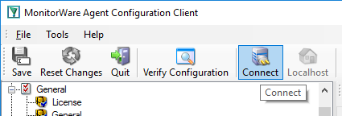
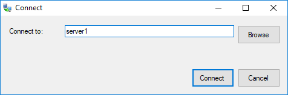

.. index:: Connect to Computer

Connect to Computer
===================

Click the Connect button in order to access another machine remotely.
A window will open up.

Here you can enter the name of the machine you want to configure remotely.
You can either directly enter the name into the textfield or you use the Browse
button to see a list of available machines in the network. The click on the
Connect button, the configuration client will verify access to the remote
machine. If the verification is successful, you will be able to proceed with
the remote access. Otherwise an error message will be shown.

**Please Note:** For remote configurations, you must ensure, that the remote machine

is accessible by network and has access rights for the current logged on local user.
