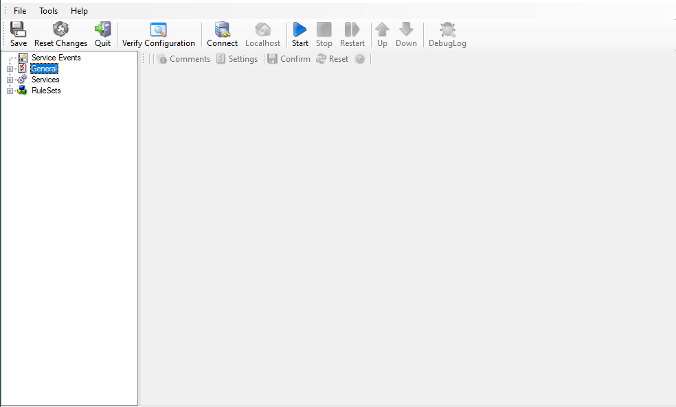
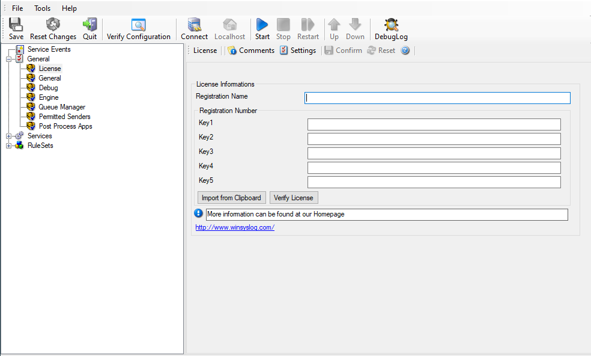

:orphan:

How to enter the license information
====================================

Article created 2021-10-05 by adiscon team

This article describes how to enter the license information you received via
mail by buying one of our products.

The Article is applicable to EventReporter, MonitorWare Agent, WinSyslog and
Rsyslog WindowsAgent.

The license screen can be found on the left side of the client under the item
General. Applying the license is very straightforward with only a few steps.
After purchase, you will receive an email from us that contains the license
name and key.

Under General - on the left side of the Configuration Client - you will find
the menu entry: License.

If you click on it, you will find the license screen on the right.

The easiest way is to copy and paste the license name without quotation marks
into the field "Registration Name" because it is case sensitive and must be
entered exactly as given. Leading and trailing spaces are also part of the
registration name. Be careful not to enter any.

Copy the full license key and use the button "Import from Clipboard" to paste
it into the key fields. The client detects invalid registration numbers and
reports the corresponding error.

Save the configuration and restart the service.

This is all that will be required to apply the license.
