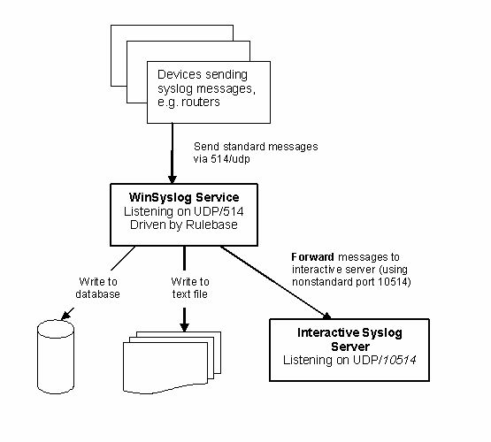

How these components work together
==================================

Once the service is configured, it operates in the background and performs the
configured duties. Most importantly, this includes receiving Syslog messages,
processing them via the rule base and storing them e.g. to a database, text
file, or creating alerts.

The WinSyslog service itself does not have any interactive component. If Syslog
messages should be displayed with a Windows GUI, the Interactive Syslog server
is needed. That server is implemented as a lightweight Syslog server. So itself
is a full Syslog server with limited capabilities but interactive message
display. It performs its work only while it is running. To view Syslog messages
interactively, the WinSyslog service forwards them to the Interactive server.
By default, this is done via the non-standard port 10514 over UDP. As such,
both Syslog servers (the service as well as the interactive one) can run on a
single machine without conflicts.

The message flow can be seen in this diagram:

In a typical configuration, the Syslog devices (for example routers or
switches) send standard Syslog messages via port 514 to the WinSyslog service.
The service receives these messages and processes them as configured in the
rule base. In our example, there are three actions configured for all incoming
messages: writing them to a database, to a text file as well as forwarding them
to the Interactive Syslog server.

By default, messages are forwarded to the local (127.0.0.1) Interactive Server
via port 10514. The Interactive Server in turn listens to that port and
receives the forwarded Syslog messages from the server.

In UNIX-speak, the WinSyslog Service acts as a receiver as well as a Syslog
relay. The Interactive Syslog server is just a receiver (and can never relay).

In fact, we have a cascaded Syslog server configuration here. Please note that
the Interactive Server is able to display the original message origin's address
as the message source because it honors a custom extension to the Syslog
protocol that enables this functionality.

The Configuration Client is only needed to create the service configuration.
Once this is done, it need not to be used and as such is not part of the
message flow.

Adiscon LogAnalyzer is only needed if accessing Syslog messages over the web is
desired. It is a convenient facility to access MonitorWare gathered events over
the web. All major browsers are supported. Adiscon LogAnalyzer is included in
the WinSyslog install set. It gets copied onto machine but not installed. For
installation of Adiscon LogAnalyzer, refer to the installation instructions in
the doc folder of Adiscon LogAnalyzer or see the online manual at
https://loganalyzer.adiscon.com/doc/manual.html. Please contact Adiscon via the
`Customer Service System <https://ticket.adiscon.com>`_, if you want some more
help in this regard.

Please keep in mind that the above example is just an example - there are
numerous ways to configure WinSyslog and its components to suit every specific
need. But we hope this sample clarifies how the WinSyslog components work
together.
