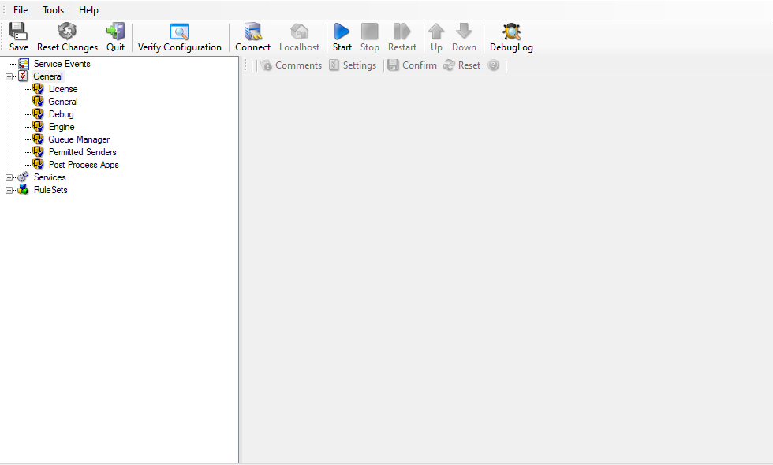

Configuring WinSyslog
=====================

In this chapter, you will learn how to configure the WinSyslog Service.

The most important part of WinSyslog - the service - runs in the background
once it is configured. There is no manual intervention needed to operate it.
As such, this chapter focuses on the WinSyslog configuration Client
application. It is used to configure the service settings.

To run the WinSyslog Configuration Client, simply click its icon present in the
WinSyslog program folder located in the Start menu. Once started, a Window
similar to the following one appears:

* Configuration Client*

The configuration Client ("the Client") has two elements. On the left hand side
is a tree view that allows you to select the various elements of the WinSyslog
system. On the right hand side are parameters specific to the element selected
in the tree view. In the sample above, the right hand side displays the
specific parameters for a rule action.

The tree view has three top-level elements: General / Defaults, Running
Services, and RuleSets.

Under General / Defaults, basic operational parameters as well as defaults for
actions and services are defined. The default themselves do not activate
anything. However, the parameters in here are used each time an actual service
or action needs a configuration parameter and none is defined in that specific
instance. We highly recommend putting the most common parameters into the
defaults, which reduces the amount of data entry in the specific elements
dramatically. Please note that each default can be overwritten in a specific
service or action.

The tree view's Running Services area lists all configured services as well as
their parameters. There is exactly one service entry for each service created.
Please note that there can be as many instances of a specific service type as
your application requires. Typically, there can be multiple instances of the
same service running, as long as their configuration parameters do not
conflict. For example the syslog service: there can be multiple syslog servers
on a given system as long as they listen to different ports. Consequently,
there can be multiple instances of the syslog service be created. For example,
there could be three of them: two listen to the default port of 514, but one
with TCP and one with UDP, and a third one listens to UDP, port 10514. All three
coexist and run at the same time. If these three services are listening to the
same port then an error message is logged into Windows Event Log that more than
one instance of Syslog server is running. After which WinSyslog wouldn't be
able to perform the desired action.

Theoretically, you can run a few hundred services in a single service instance.
However, both from a usage scenario point of view as well as concerning
operating system resources, we recommend limiting the services to a maximum of
20 to 30. Of course, there are some applications where more than this limit is
useful. MonitorWare Agent does not restrict this number. If there is a need for
a large number of services and the hardware is capable of managing all these
tasks, there is nothing in the MonitorWare Agent that limits from doing so.

The actual parameters depend on the service type. Common to all services is the
capability to enable or disable a service. A service is started only if it is
enabled. Otherwise, it will not run, but the configuration data can still be
present. That way, it is easy to temporarily disable a service without deleting
it.

Also common to all service types is the association to a ruleset seen at the
bottom of the right hand configuration dialog. This specifies which of the rule
sets will be applied to information units generated by this service.

To create a new service, right click on "Running Services". Then select
"Add Service" and the respective service type from the pop up menu. Then follow
the wizard. To delete an existing service, right click it and select
"Delete Service". This removes the service and its configuration is now
irrecoverable. To temporarily "Remove a service", simply disable it in the
property sheet.

The tree view's last main element is RuleSets. Here, all rulesets are
configured. Directly beneath "Rules" are the individual rulesets. Each set is
completely independent from each other. They are just centrally stored so they
can be associated with services (see above for an explanation).

Beneath each ruleset are the individual rules. As described in Rules , a
rule's position in the list is vitally important. :doc:`rules <../glossaryofterms/rules>` at the top of the rule
set are executed before those further down. To move a rule up or down, simply
right click it and select "move up" or "move down" from the pop up menu.

In the tree view, filter conditions and actions are beneath the rule they are
associated with. Finally, beneath actions are all actions to carry out.

The following sections describe each element's properties.
