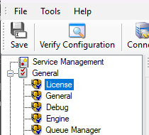
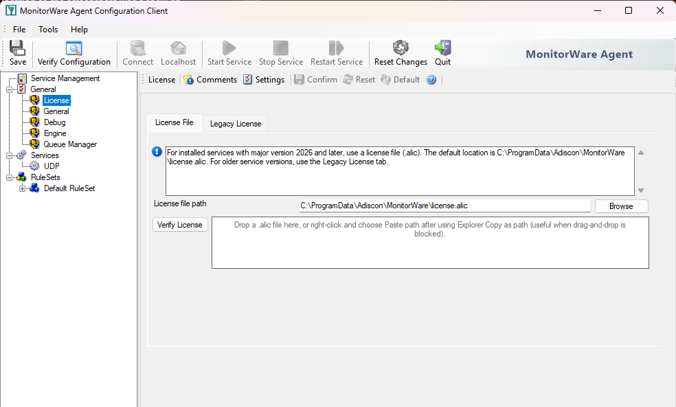

.. _winsyslog-enter-license-information:

How Do I Enter WinSyslog License Information?
=============================================

Answer
------

Open the WinSyslog Configuration Client, go to **General** -> **License**,
enter the registration name exactly as provided, import the license key, save
the configuration, and restart the WinSyslog service.

Details
-------

After you purchase WinSyslog, Adiscon sends the license information by email.
That message contains:

* the registration name
* the license key

The registration name is case-sensitive and must match the delivered value
exactly. Do not add quotation marks, leading spaces, or trailing spaces.

Action Path
-----------

1. Open the WinSyslog Configuration Client.
2. In the left pane, expand **General** and select **License**.

3. Copy the registration name from the delivery email into
   **Registration Name**.
4. Copy the full license key and click **Import from Clipboard**.

5. Save the configuration.
6. Restart the WinSyslog service so the updated license state is applied.

Verification
------------

After the service restart, reopen the license page and confirm that the
license information is shown without validation errors. If the key is rejected,
check for mismatched characters, missing key blocks, or unwanted spaces in the
registration name.

Related Information
-------------------

* :doc:`what-is-freeware-mode`
* :doc:`../installation`
* :doc:`../../shared/sales/how-to-contact-sales`
