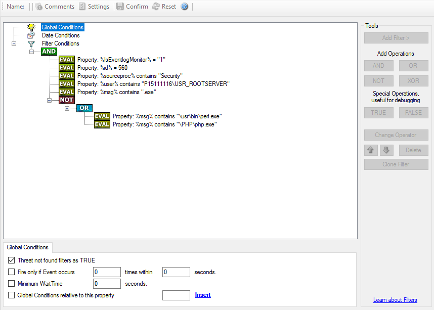

Filter conditions
=================

Filter conditions determine whether a rule matches an event. If a condition
evaluates to true, the actions in that rule run.

WinSyslog supports simple filters and complex Boolean trees. This lets you use
broad capture rules for storage or narrow, high-signal rules for alerting and
forwarding.

Default filter behavior
-----------------------

By default, the filter-condition tree contains a single top-level ``AND``. That
structure always evaluates to true until you add real conditions, so it is
commonly used for broad capture rules such as writing all incoming events to a
file or database.

.. figure:: ../images/f-filterconditions_1.png
   :width: 100%
   :alt: WinSyslog filter condition tree with the default top-level AND condition

   Default filter tree with a single top-level ``AND`` condition.

Building more selective filters
-------------------------------

More advanced rules can combine multiple conditions with nested Boolean logic.
The sample below shows a more selective filter structure.

   Example of a more selective filter with nested Boolean conditions.

How to think about filter logic
-------------------------------

A useful mental model is:

- a filter that evaluates to **true** allows the rule's actions to run
- a filter that evaluates to **false** prevents those actions from running
- negation with **NOT** is often the key to expressing exceptions cleanly

The classic example is exclusion logic: if a condition should match everything
except a small set of known-safe events, define the safe events first and then
negate that result.

Practical guidance
------------------

- String comparisons in filter conditions are case-sensitive.
- Start with the simplest condition that solves the problem.
- Add nesting only when simpler rule separation would not be clearer.
- Use wait times and throttling carefully to prevent alert storms.

If you need advanced modeling help, see
:doc:`complex filter conditions <../shared/references/complexfilterconditions>`.

Filter condition reference pages
--------------------------------

.. toctree::
   :maxdepth: 2

   ../mwagentspecific/f-globalconditions
   ../mwagentspecific/f-dateconditions
   ../mwagentspecific/f-operators
   ../mwagentspecific/f-filters

Basic filters
-------------

.. toctree::
   :maxdepth: 1

   ../mwagentspecific/f-general
   ../mwagentspecific/f-datetime
   ../mwagentspecific/f-informationunittype

Network-related filters
-----------------------

.. toctree::
   :maxdepth: 1

   ../mwagentspecific/f-syslog
   ../mwagentspecific/f-snmptraps

Event and file monitoring filters
---------------------------------

.. toctree::
   :maxdepth: 1

   ../mwagentspecific/f-eventlogmonitorv1
   ../mwagentspecific/f-eventlogmonitorv2
   ../mwagentspecific/f-filemonitor

Custom property filters
-----------------------

.. toctree::
   :maxdepth: 1

   ../mwagentspecific/f-customproperty
   ../mwagentspecific/f-extendednumberproperty
   ../mwagentspecific/f-extendedipproperty
   ../mwagentspecific/f-fileexists
   ../mwagentspecific/f-storefilterresults
