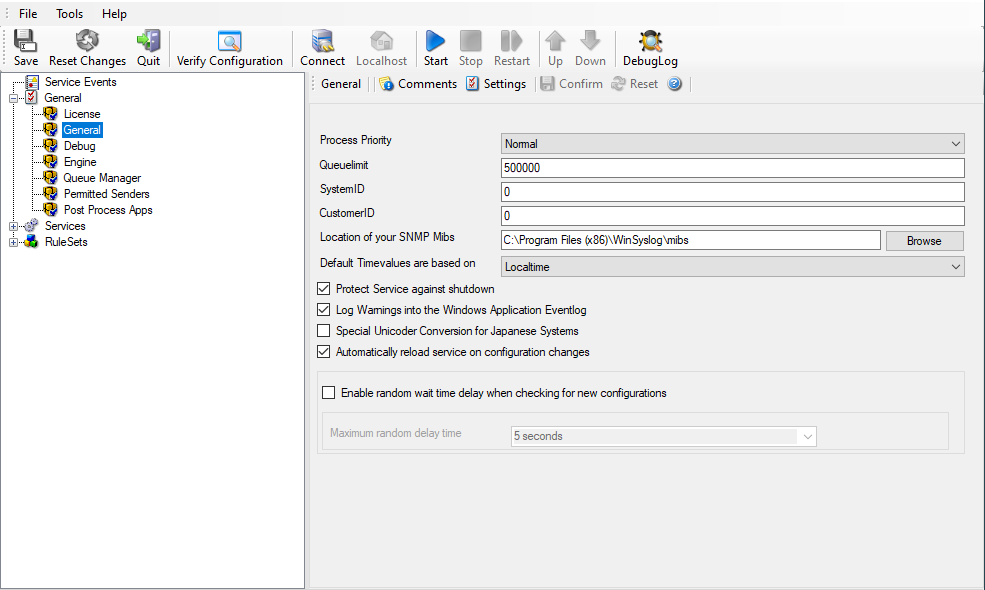

General
=======

The General Options available on this form are explained below:

Process Priority
^^^^^^^^^^^^^^^^

**File Configuration field:**
  nProcessPriority

**Description**
  Configurable Process Priority to fine-tune application behavior.

Queue Limit
^^^^^^^^^^^

**File Configuration field:**
  nQueueLimit

**Description**
  The applications keeps an in-memory buffer where events received but not yet
  processed are stored. This allows the product to handle large message bursts.
  During such burst, the event is received and placed in the in-memory queue.
  The processing of the queue (via rulesets) itself is de-coupled from the
  process of receiving. During traffic bursts, the queue size increases,
  causing additional memory to be allocated. At the end of the burst, the queue
  size decreases and the memory is freed again.

  Using the queue limit, you can limit that maximum number of events that can
  be in the queue at any given time. Once the limit is reached, no further
  enqueuing is possible. In this case, an old event must first be processed.
  In such situations, incoming events might be lost (depending on the rate they
  come in at). A high value for the queue size limit (e.g. 500,000) is
  recommended, because of the risk of message loss. It is also possible to
  place no limit on the queue. Use the value zero (0) for this case. In this
  case, the queue size is only limited by virtual memory available. However, we
  do not recommend this configuration as it might cause the product to use up
  all available system memory, which in turn could lead to a system failure.

SystemID
^^^^^^^^

**File Configuration field:**
  nSystemID

**Description**
  SystemID is of type integer to be used by our customer. In addition, it is
  user configurable.

CustomerID
^^^^^^^^^^

**File Configuration field:**
  nCustomerID

**Description**
  CustomerID is of type integer provided for customer ease. For example if
  someone monitors his customer's server, he can put in different CustomerIDs
  into each of the clients. Let us say someone monitors servers A and B. A has
  5 servers all of them with CustomerID = 1 and B has 2 servers all of them
  with CustomerID = 2. Both A and B happen to have a server named "SERVER".
  Together with the customerID, these machines are now uniquely identifiable.
  This is user configurable.

Location of your SNMP MIBs
^^^^^^^^^^^^^^^^^^^^^^^^^^

**File Configuration field:**
  szMIBSPath

**Description**
  Click the Browse button to search for your MIBs location or enter the path
  manually. The Client and Service will read all files from this directory
  automatically on startup.

Default Timevalues are based on
^^^^^^^^^^^^^^^^^^^^^^^^^^^^^^^

**File Configuration field:**
  nTimeMode

**Description**

The general options of each product (EventReporter, MonitorWare Agent and
WinSyslog) contain a setting for the "Default Timevalues are based on". This
setting can be set to Localtime which is default and UTC (Universal Coordinated
Time). This setting has an effect on:

* Send Email Action: The date in the email header is affected
* Start Program Action: Time parameters in the command line are affected
* Write File Action: Time properties in the file name are affected
* Filter Engine: If you filter by weekday or time fields, localtime does affect
  the filter result

For information about "How can I get localtime output" please see
:doc:`default timevalues setting in EventReporter/MonitorWare Agent/WinSyslog explained <../articles/default-timevalues-setting>`.

Protect Service against shutdown
^^^^^^^^^^^^^^^^^^^^^^^^^^^^^^^^

**File Configuration field:**
   nProtectAgainstShutdown

**Description**
  When enabled (default), the Agent will not stop processing the internal queue when it
  is stopped.
  **Please note that it will remain in the stopping state then.**

Log Warnings into the Windows Application Eventlog
^^^^^^^^^^^^^^^^^^^^^^^^^^^^^^^^^^^^^^^^^^^^^^^^^^

**File Configuration field:**
  nEnableEventlogWarnings

**Description**
  The Service will also log Warnings into the Windows Application Eventlog, and
  so be more verbose for troubleshooting. Default is enabled.

Special Unicoder Conversion for Japanese Systems
^^^^^^^^^^^^^^^^^^^^^^^^^^^^^^^^^^^^^^^^^^^^^^^^

**File Configuration field:**
  nJapanStringHandling

**Description**
  This is a historical option for older multibyte systems from the time when
  UTF8 was not known yet. If enabled, whenever text is being converted from 16
  Bit wide character to 8 Bit character, the conversion is done with bit
  masking in order to avoid broken encoding. **For today modern systems, we do NOT recommend to enable this option.**

.. _automatically-reload-service:

Automatically reload service on configuration changes
^^^^^^^^^^^^^^^^^^^^^^^^^^^^^^^^^^^^^^^^^^^^^^^^^^^^^

**File Configuration field:**
  nEnableAutoConfigReload

**Description**
  When enabled (default), the service will detect configuration changes and
  reload it's core automatically. This feature only works if the latest Client
  Application is used for configuration. It will also work if you are using the
  file based configuration method and update the configuration file. It will
  not work if you are using the service in console mode unless you send any
  input to the console.

Enable random wait time delay when checking for new configurations
^^^^^^^^^^^^^^^^^^^^^^^^^^^^^^^^^^^^^^^^^^^^^^^^^^^^^^^^^^^^^^^^^^

**File Configuration field:**
  bAutoReloadRandomDelay
**Description**
  When enabled, a random delay (with the configured maximum) will be added
  between new configuration checks.

Maximum random delay time
^^^^^^^^^^^^^^^^^^^^^^^^^

**File Configuration field:**
  nAutoReloadDelayTime

**Description**
  The maximum for this random delay is 24 hours. The random delay has no affect
  on the service control anymore.
