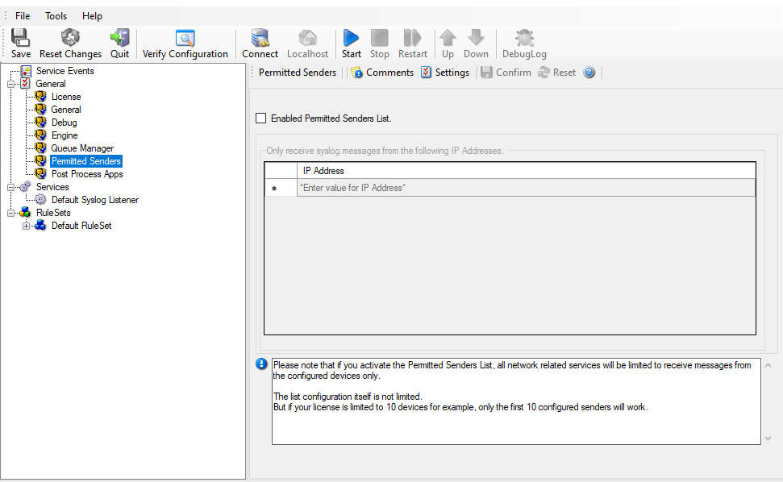

Permitted Senders
=================

**Please note that if you activate the Permitted Senders List, all network**
related services will be limited to receive messages from the configured
devices only.**

**The list configuration itself is not limited.**

**But if your license is limited to 10 devices for example, only the first 10**
configured senders will work.**

Enable permitted Senders List
^^^^^^^^^^^^^^^^^^^^^^^^^^^^^

**File Configuration field:**
   nEnablePermittedSenders

**Description**
    If this option is enabled, all network related services will be limited to
    receive messages only from the configured IP Addresses. Please note the
    list is also limited to your license limit. For example if your license
    allows 10 devices, only the first 10 configured senders will be allowed.

Only receive syslog messages from the following IP Addresses
^^^^^^^^^^^^^^^^^^^^^^^^^^^^^^^^^^^^^^^^^^^^^^^^^^^^^^^^^^^^

**File Configuration field:**
    szIP_[n]

**Description**
    This list contains all sender IP Addresses which are allowed to send data
    to network related services. You can either configure IPv4 or IPv6
    Addresses here.
