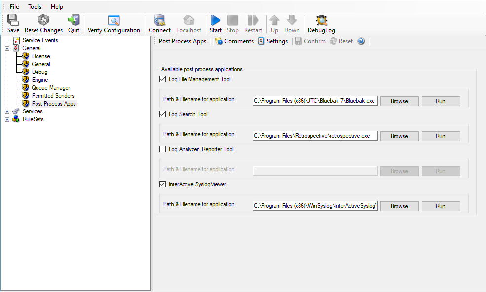

Post Process Apps
=================

Available post process applications
-----------------------------------

Log File Management Tool
^^^^^^^^^^^^^^^^^^^^^^^^

**File Configuration field:**
   nlogfilemgr on/off

**Description**
   Enable or disable shortcut for the Log File Management Tool application.

Path & Filename for application
^^^^^^^^^^^^^^^^^^^^^^^^^^^^^^^

**File Configuration field:**
   logfilemgr_path

**Description**
   Path and Filename of the Log File Management application executable.

Log Search Tool
^^^^^^^^^^^^^^^

**File Configuration field:**
   nlogsearch on/off

**Description**
   Enable or disable shortcut for the Log Search Tool application.

Path & Filename for application
^^^^^^^^^^^^^^^^^^^^^^^^^^^^^^^

**File Configuration field:**
   logsearch_path C:\\Program Files\\Retrospective\\retrospective.exe

**Description**
   Path and Filename of the Log Search application executable.

Log Analyzer Reporter Tool
^^^^^^^^^^^^^^^^^^^^^^^^^^

**File Configuration field:**
   nloganalyzer on/off

**Description**
   Enable or disable shortcut for the LogAnalyzer application.

Path & Filename for application
^^^^^^^^^^^^^^^^^^^^^^^^^^^^^^^

**File Configuration field:**
   $loganalyzer_path

**Description**
   Path and Filename of the LogAnalyzer application executable.

InterActive SyslogViewer
^^^^^^^^^^^^^^^^^^^^^^^^

**File Configuration field:**
   ninteractive on/off

**Description**
   Enable or disable shortcut for the InterActive SyslogViewer application.

Path & Filename for application
^^^^^^^^^^^^^^^^^^^^^^^^^^^^^^^

**File Configuration field:**
   interactive_path

**Description**
   Path and Filename of the InterActive SyslogViewer application executable.
