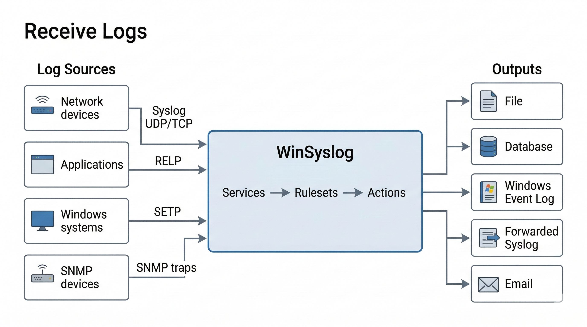

.. _winsyslog-tour-receive-logs:

Receive Logs
============

WinSyslog receives logs from multiple sources and turns them into events that
can be processed by rules.

*WinSyslog can receive logs from multiple source types, process them through
input services, rulesets, and actions, and then store or forward them to
downstream targets.*

In this manual, **input** is the clearest plain-language concept for receive
configuration, while **service** remains the main operational term. Some GUI
pages still use exact labels such as ``Syslog server``, ``RELP Listener``, and
``SETP Server`` for specific service types.

What you can receive:

- Syslog over UDP/TCP and secure syslog over TLS
- RELP (reliable transport)
- Windows Event Log events
- SNMP traps

Where to configure it:

- :doc:`Services <../services>` provide the configured input services.
- :doc:`Syslog server service <../../mwagentspecific/syslogserver>` receives syslog.
- :doc:`RELP Listener service <../../mwagentspecific/relplistener>` receives RELP.
- :doc:`SETP Server service <../../mwagentspecific/setpserver>` receives SETP.
- :doc:`SNMP Trap Receiver service <../../mwagentspecific/snmptrapreceiver>` receives SNMP traps.
- If you run multiple input services, see
  :doc:`../../shared/faq/listener-binding-rules` before reusing a port for
  another service. In that FAQ, ``listener`` refers to the network side of a
  service.

Quick verification:

- In the WinSyslog Configuration Client, open `Tools` and use `Send Syslog Test Message`
  (see :ref:`Send Syslog Test Message <winsyslog-send-test-message>`).
- Confirm messages arrive in the configured ruleset (for example, write to a file).
