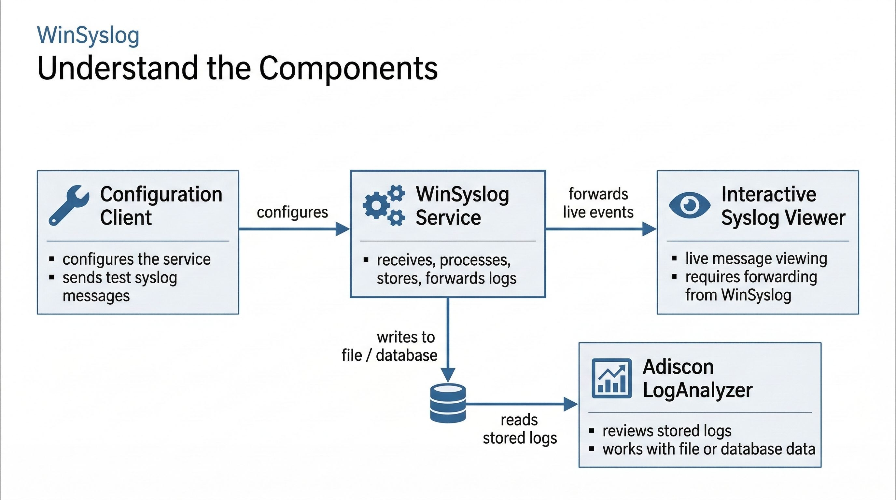

.. _winsyslog-tour-understand-components:

Understand the Components
=========================

WinSyslog is easiest to understand if you separate its main components by role.

   WinSyslog consists of a background service, a configuration client, a live
   viewer, and an optional analysis component for stored logs.

The four components
-------------------

1. **WinSyslog Service**
   This is the main runtime component. It runs in the background as a Windows
   service, receives log data through configured input services, processes it
   through rulesets and actions, and stores or forwards the results.
2. **WinSyslog Configuration Client**
   This is the administrative user interface. You use it to configure input
   services, rulesets, filters, and actions. Changes are made in the
   Configuration Client and then applied to the WinSyslog service. It is also
   where you send a test syslog message from the ``Tools`` menu.
3. **Interactive Syslog Viewer**
   This is the live-view component for interactive monitoring. It does not show
   data automatically by itself. WinSyslog must forward messages to it via a
   rule.
4. **Adiscon LogAnalyzer**
   This is an optional analysis component for working with stored logs,
   especially in files or databases. It is for browsing and reviewing retained
   data, not for live message intake. Users who prefer a simpler standalone
   tool for direct log file review may also consider the third-party log viewer
   `Retrospective <https://www.centeractive.com/products>`_ by centeractive.

How they fit together
---------------------

- The **WinSyslog service** runs the configured input services, rulesets, and
  actions that do the actual receiving, processing, storing, and forwarding.
- The **configuration client** defines what those input services, rulesets,
  and actions should do and is where configuration changes are applied before
  the runtime service uses them.
- The **Interactive Syslog Viewer** can display incoming messages live if the
  WinSyslog service forwards them there.
- **LogAnalyzer** works on stored log data after the WinSyslog service has
  written it to a file or database.

For the current split between remote administration and browser-based review,
see :doc:`../../shared/faq/remote-administration-and-browser-based-review`.

What to read next
-----------------

- To understand message intake, start with :doc:`Receive logs <receive-logs>`.
- To understand what the service does after receiving data, continue with
  :doc:`Process and filter <process-and-filter>`.
- To understand where data can go next, see :doc:`Store and forward <store-and-forward>`.
- For the more detailed legacy explanation, see :doc:`../components` and
  :doc:`../componentsworktogether`.
